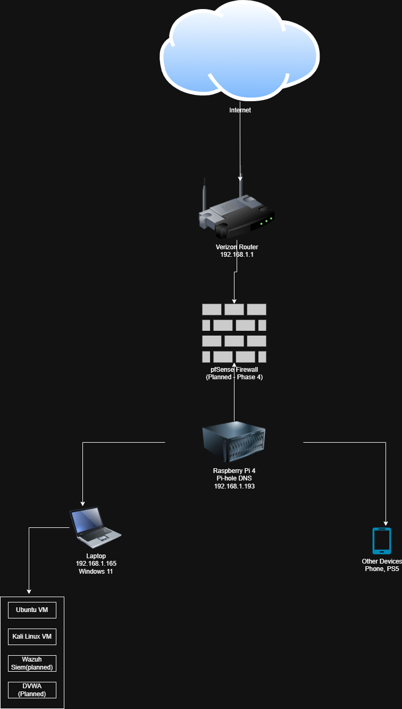

# Setting Up a Home Lab

## Network Topology

## Overview
This repository documents my home lab project covering 
virtual machine setup, network design, and security tooling. 
It is built as a hands-on cybersecurity portfolio to 
demonstrate practical skills in networking, virtualization, 
and security monitoring.

## Tools & Technologies
- Oracle VirtualBox
- Ubuntu Linux
- Kali Linux
- Raspberry Pi 4
- Pi-hole DNS Filter
- pfSense Firewall (Planned)
- Wazuh SIEM (Planned)
- DVWA (Planned)

## Documentation

| Guide | Description |
|---|---|
| [Ubuntu VM Installation](ubuntu-vm-install.md) | Step-by-step guide to installing Ubuntu on VirtualBox |
| [Pi-hole Setup](pihole-setup.md) | Setting up Pi-hole on Raspberry Pi 4 |

## Project Status
🔄 In Progress

## Author
OlamideB