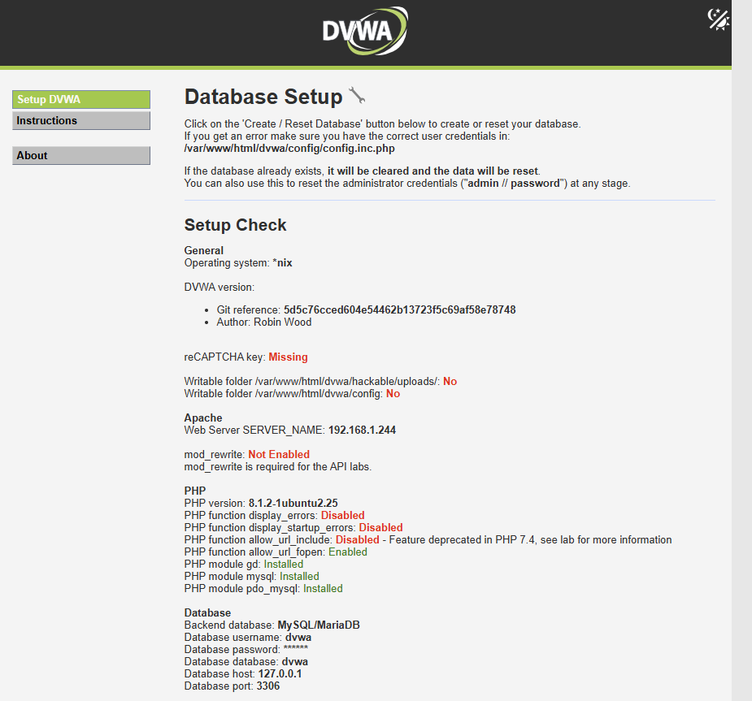
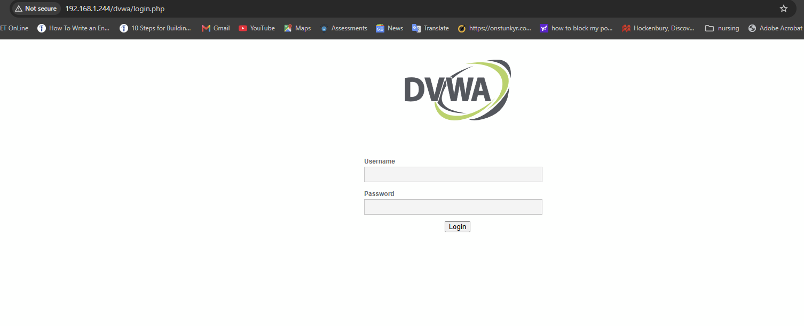
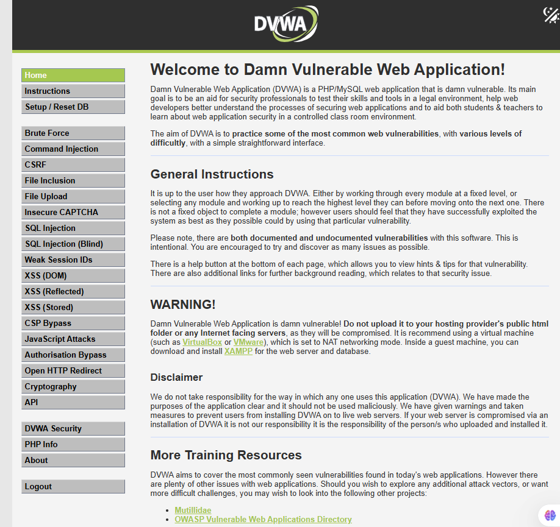
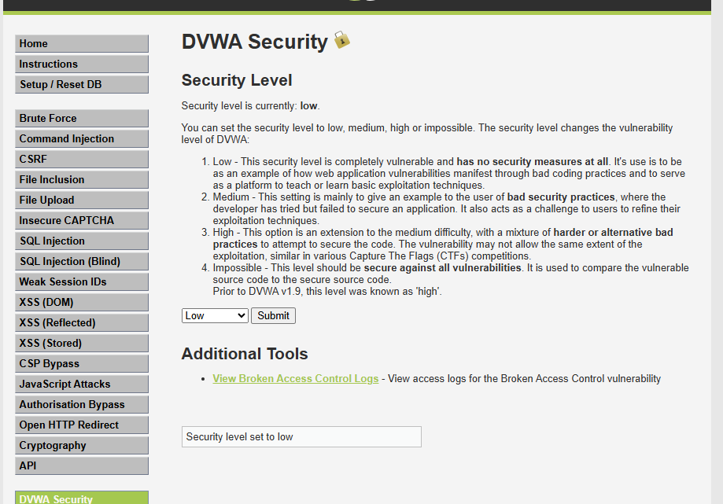

# Setting Up DVWA (Damn Vulnerable Web Application)

## What is DVWA?

DVWA (Damn Vulnerable Web Application) is a 
deliberately insecure web application used by 
security professionals and students to enhance 
their cybersecurity skills in a safe and controlled 
environment.

It provides a legal and safe target to practice 
common web application attacks including SQL 
injection, brute force, cross site scripting and 
more without affecting real systems.

## Why DVWA?

In this home lab DVWA is used to:

- Simulate a vulnerable web application target
- Practice real world attack techniques
- Test Wazuh SIEM detection capabilities
- Generate security alerts for investigation
- Produce findings for a SOC incident report

## How DVWA Works in This Lab
```
Kali Linux VM → attacks DVWA
↓
Ubuntu-DVWA VM → hosts DVWA web application
↓
Wazuh SIEM → detects and logs the attacks
↓
SOC Analyst → investigates alerts and writes
incident report
```

## System Requirements

### Ubuntu-DVWA VM Specifications
- OS: Ubuntu Server 22.04 LTS
- RAM: 2GB
- Storage: 50GB
- Network: Bridged Adapter
- IP Address: 192.168.1.244

### Software Requirements
- Apache2 web server
- PHP
- MariaDB database
- Git

---

## Part 1: Installing DVWA

### Step 1: Install Required Packages

SSH into your Ubuntu-DVWA VM and run:

```bash
sudo apt update && sudo apt upgrade -y
sudo apt install -y apache2 php php-mysqli php-gd libapache2-mod-php mariadb-server git
```

This installs:
- **Apache2** — web server that serves DVWA
- **PHP** — programming language DVWA is built on
- **MariaDB** — database that stores DVWA data
- **Git** — used to download DVWA from GitHub

### Step 2: Download DVWA from GitHub

Clone the DVWA repository into the Apache web folder:

```bash
sudo git clone https://github.com/digininja/DVWA.git /var/www/html/dvwa
```

### Step 3: Configure DVWA

Copy the sample config file:

```bash
sudo cp /var/www/html/dvwa/config/config.inc.php.dist /var/www/html/dvwa/config/config.inc.php
```

Set correct permissions so Apache can access DVWA:

```bash
sudo chown -R www-data:www-data /var/www/html/dvwa
sudo chmod -R 755 /var/www/html/dvwa
```

### Step 4: Set Up Database

Start MariaDB:

```bash
sudo systemctl start mariadb
sudo systemctl enable mariadb
```

Secure the installation:

```bash
sudo mysql_secure_installation
```

Create the DVWA database and user:

```bash
sudo mysql -u root -p
```

```sql
CREATE DATABASE dvwa;
CREATE USER 'dvwa'@'localhost' IDENTIFIED BY 'p@ssw0rd';
GRANT ALL PRIVILEGES ON dvwa.* TO 'dvwa'@'localhost';
FLUSH PRIVILEGES;
EXIT;
```

### Step 5: Update Config File

Edit the DVWA config file:

```bash
sudo nano /var/www/html/dvwa/config/config.inc.php
```

Update the database password:

```php
$_DVWA['db_password'] = getenv('DB_PASSWORD') ?: 'p@ssw0rd';
```

### Step 6: Start Apache

```bash
sudo systemctl start apache2
sudo systemctl enable apache2
```

### Step 7: Change Network Adapter to Bridged

By default the VM uses NAT which gives a 
10.0.2.x address that is not accessible 
from your laptop browser.

1. Power off the VM
2. Go to **Settings → Network**
3. Change **Attached to: NAT** to **Bridged Adapter**
4. Start the VM again
5. Run `ip a` to get the new IP address

The VM should now have a **192.168.1.x** address!

---

## Part 2: Accessing DVWA

### Step 1: Find VM IP Address

```bash
ip a
```

Look for the **inet** address under **enp0s3**:
```
192.168.1.244
```

### Step 2: Access Setup Page

Open your laptop browser and go to:

`http://192.168.1.244/dvwa/setup.php`

You will see the DVWA setup page showing 
system information and a button at the bottom.


<p><em>DVWA setup page showing system status and create database button</em></p>

### Step 3: Create Database

Click the **Create / Reset Database** button 
at the bottom of the setup page.

This creates all the necessary database tables 
and populates DVWA with sample vulnerable data.

You will be automatically redirected to the 
login page after the database is created.

### Step 4: Login to DVWA

**Default credentials:**
```
Username: admin
Password: password
```


<p><em>DVWA login page</em></p>

### Step 5: DVWA Dashboard

After logging in you will see the DVWA 
dashboard with a menu on the left side 
containing all the vulnerability modules:

- Brute Force
- Command Injection
- CSRF
- File Inclusion
- File Upload
- SQL Injection
- XSS (Reflected)
- XSS (Stored)
- And more!


<p><em>DVWA dashboard showing all available vulnerability modules</em></p>

### Step 6: Set Security Level

1. Click **DVWA Security** in the left sidebar
2. Change security level to **Low**
3. Click **Submit**

Setting the level to Low makes all 
vulnerabilities fully exploitable for 
practice purposes.


<p><em>DVWA security level set to Low for practice</em></p>

> Note: In a real environment Low security 
> would never be used. This setting is only 
> for controlled home lab practice.

---

## What's Next

DVWA is now fully installed and configured. 
In Phase 6 Kali Linux will be used to perform 
attacks against DVWA including:

- SQL injection attacks
- Brute force login attempts
- Cross site scripting (XSS)

Wazuh will monitor and detect these attacks 
generating security alerts for investigation 
and incident reporting.