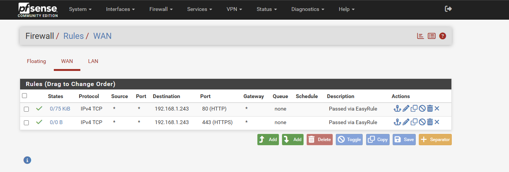
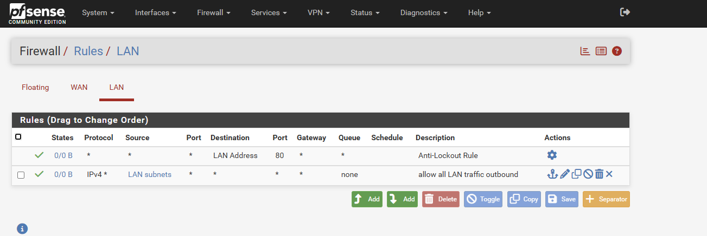

# Setting Up pfSense Firewall

## What is pfSense?

pfSense is a free open source firewall and router 
based on FreeBSD. It provides enterprise grade 
firewall features including traffic filtering, 
NAT, VPN and network segmentation. In this home 
lab pfSense acts as the firewall between the 
internal VM network and the home network.

## Why pfSense?

pfSense was chosen for this home lab because it:

- Is free and open source
- Provides real world firewall experience
- Is widely used in enterprise environments
- Supports advanced firewall rules and NAT
- Integrates with Wazuh for security monitoring
- Is directly relevant to SOC analyst work

## Network Architecture

With pfSense added the home lab network looks like:

```
Internet
    ↓
Verizon Router (192.168.1.1)
    ↓
pfSense Firewall
WAN: 192.168.1.243
LAN: 192.168.2.1
    ↓
Internal VM Network (192.168.2.0/24)
    ├── Ubuntu VM
    ├── Kali Linux VM
    └── DVWA (coming Phase 5)
```

## System Requirements

### pfSense VM Specifications
- OS: pfSense 2.8.1
- RAM: 1GB minimum
- Storage: 10GB minimum
- Network Adapters: 2
  - Adapter 1 (WAN): Bridged Adapter
  - Adapter 2 (LAN): Internal Network

---

## Part 1: Installing pfSense

### Step 1: Download pfSense

Go to [pfsense.org](https://www.pfsense.org/download/) 
and download the latest pfSense ISO file.

Select:
- **Architecture:** AMD64
- **Installer:** DVD Image (ISO)
- **Mirror:** closest to your location

### Step 2: Create pfSense VM in VirtualBox

Create a new VM in VirtualBox with these settings:

- **Name:** pfsense00
- **Type:** BSD
- **Version:** FreeBSD (64-bit)
- **RAM:** 1024 MB (1GB)
- **Storage:** 10GB
- **Hard Disk Format:** VDI

> Note: For detailed steps on creating a VM 
> refer to the 
> [Ubuntu VM Installation Guide](ubuntu-vm-install.md)

### Step 3: Configure Network Adapters

pfSense requires two network adapters:

**Adapter 1 (WAN):**
1. Go to VM **Settings → Network → Adapter 1**
2. Check **Enable Network Adapter**
3. Attached to: **Bridged Adapter**
4. Select your WiFi adapter name

**Adapter 2 (LAN):**
1. Click **Adapter 2** tab
2. Check **Enable Network Adapter**
3. Attached to: **Internal Network**
4. Name: **intnet**

> Note: The VM must be powered off before 
> changing network adapter settings.

### Step 4: Install pfSense

1. Start the VM with the pfSense ISO mounted
2. Follow the installation wizard
3. Accept all default settings
4. Select **Install pfSense**
5. Choose **Auto (ZFS)** partition scheme
6. Wait for installation to complete
7. Remove the ISO and reboot

---

## Part 2: Initial Configuration

### Step 1: Assign Interfaces

After booting you will see the pfSense console menu.

At the top of the screen check the interface status:

```
WAN → em0 → your IP address
LAN → em1 → not configured yet
```
Press **1** to assign interfaces:
- Type **n** when asked about VLANs
- WAN interface: type **em0**
- LAN interface: type **em1**
- Type **y** to confirm

### Step 2: Set LAN IP Address

Press **2** to set interface IP addresses:

1. Type **2** to select LAN
2. Enter IPv4 address: `192.168.2.1`
3. Enter subnet bit count: `24`
4. Press **Enter** to skip upstream gateway
5. Press **Enter** to skip IPv6
6. Type **n** when asked about DHCPv6
7. Type **y** to enable DHCP server
8. DHCP start address: `192.168.2.100`
9. DHCP end address: `192.168.2.200`

After configuration the console should show:
```
WAN → 192.168.1.243
LAN → 192.168.2.1
```
### Step 3: Enable WAN Web Access

By default pfSense blocks web GUI access from 
the WAN side. To enable access run the following 
commands from the pfSense shell.

Press **8** for Shell and run:

```bash
easyrule pass wan tcp any 192.168.1.243 80
easyrule pass wan tcp any 192.168.1.243 443
```

> Note: The command `pfSsh.php playback enableallowallwan`
> only adds IPv6 rules not IPv4. Use the easyrule 
> commands above instead for IPv4 access.

If the dashboard is still not accessible disable 
the firewall temporarily:

```bash
pfctl -d
```

Then access the dashboard immediately and add 
permanent rules from the GUI. Re-enable the 
firewall after:

```bash
pfctl -e
```

### Step 4: Access pfSense Dashboard

Open your laptop browser and go to:

`http://192.168.1.243`

**Default credentials:**
```
Username: admin
Password: pfsense
```
> **Security Warning:** Change the default 
> password immediately after first login!


<p><em>pfSense web interface login page</em></p>

### Step 5: Change Default Password

1. Click **System** in top menu
2. Click **User Manager**
3. Click the **pencil/edit icon** next to admin
4. Scroll down to password fields
5. Enter your new strong password
6. Confirm password
7. Click **Save**

> Note: Store your password securely in 
> your password manager.

### Step 6: Explore the Dashboard

After logging in you will see the pfSense 
dashboard showing:

- System information
- Interface status (WAN and LAN)
- Traffic graphs
- Firewall logs


<p><em>pfSense dashboard showing system information and interface status</em></p>


**Interface Status:**

| Interface | IP Address | Status |
|---|---|---|
| WAN | 192.168.1.243 | Active |
| LAN | 192.168.2.1 | Active |

---

## Part 3: Configuring Firewall Rules

Understanding firewall rules is critical. 
pfSense processes rules **top to bottom** and 
the first matching rule wins. All traffic is 
blocked by default unless a pass rule exists.

### WAN Rules

WAN rules control traffic coming from outside 
into pfSense. For this home lab two rules were 
configured to allow access to the pfSense 
web dashboard:

| Action | Protocol | Source | Destination | Port | Description |
|---|---|---|---|---|---|
| Pass | IPv4 TCP | Any | 192.168.1.243 | 80 | Allow HTTP to pfSense GUI |
| Pass | IPv4 TCP | Any | 192.168.1.243 | 443 | Allow HTTPS to pfSense GUI |


<p><em>pfSense WAN firewall rules allowing HTTP and HTTPS access to dashboard</em></p>

### LAN Rules

LAN rules control traffic from internal VM 
network. Two rules are configured:

| Action | Protocol | Source | Destination | Port | Description |
|---|---|---|---|---|---|
| Pass | Any | LAN address | LAN address | 80 | Anti-Lockout Rule (automatic) |
| Pass | IPv4 Any | LAN subnets | Any | Any | Allow all LAN traffic outbound |


<p><em>pfSense LAN firewall rules showing anti-lockout and outbound traffic rules</em></p>

> Note: The Anti-Lockout Rule is managed 
> automatically by pfSense and cannot be deleted. 
> It ensures you cannot accidentally lock yourself 
> out of the web GUI.

### Key Firewall Concepts Learned

**Default Deny:**
```
pfSense blocks ALL traffic by default.
Traffic is only allowed if a specific 
pass rule exists. This is called 
"implicit deny" or "default deny" and 
is a security best practice used by 
banks and enterprises.
```

**Rule Order Matters:**
```
Rules are processed top to bottom.
The first matching rule wins.
If a block rule appears before a pass rule
the traffic will be blocked even if a
pass rule exists below it!
```

**IPv4 and IPv6 are Separate:**
```
A rule for IPv6 does NOT affect IPv4.
Always specify which IP version your
rule applies to and create separate
rules for each if needed.
```

---

## Lessons Learned

During pfSense configuration several important 
cybersecurity and networking lessons were learned:

### 1. Understand Network Topology First

Before configuring firewall rules understand 
exactly where each device sits in the network. 
In this lab the laptop sits on the WAN side 
not the LAN side which affected rule behavior 
significantly.
```
Laptop (192.168.1.165) → WAN side
pfSense WAN (192.168.1.243) → WAN side
pfSense LAN (192.168.2.1) → LAN side
```

### 2. Never Delete Default Rules Without Replacements

Default firewall rules exist to maintain system 
functionality. Deleting them without proper 
replacements can cause complete loss of access 
to the system.

### 3. Test One Change at a Time

Making multiple firewall changes simultaneously 
makes it difficult to identify which change 
caused a problem. Always test after each 
individual change.

### 4. Always Backup Before Changes

Before making firewall changes always export 
the configuration:

**Diagnostics → Backup/Restore → Download**

This allows you to restore the working 
configuration if something goes wrong.

### 5. pfctl Commands for Emergency Access

```bash
pfctl -d    # Disable firewall temporarily
pfctl -e    # Re-enable firewall
pfctl -sr   # Show all current rules
```

> **Warning:** Only use pfctl -d in a home lab 
> environment. Never disable the firewall in 
> a production environment!

---

## Troubleshooting

### Cannot Access Web Dashboard

If you cannot access `http://192.168.1.243`:

1. Verify pfSense VM is running in VirtualBox
2. Verify Adapter 1 is set to **Bridged**
3. Check firewall rules — block rules may be 
   above pass rules
4. Temporarily disable firewall to verify:

```bash
pfctl -d
```

5. Access dashboard and add permanent pass rules
6. Re-enable firewall:

```bash
pfctl -e
```

### Dashboard Accessible on Phone but Not Laptop

This indicates a firewall rule order issue. 
Check that no block rules appear above your 
pass rules for port 80 and 443.

Run from Shell to see current rules:

```bash
pfctl -sr | head -30
```

### Interfaces Not Showing IP Addresses

1. Press **1** to reassign interfaces
2. Press **2** to set IP addresses manually
3. Verify network adapters in VirtualBox settings

### Cannot Change Network Adapter Settings

VirtualBox does not allow changing network 
settings while VM is running:

1. Power off the VM first
2. Go to **Settings → Network**
3. Make your changes
4. Start the VM again

### pfSsh.php enableallowallwan Not Working

This command only adds IPv6 rules in pfSense 
2.8.1. For IPv4 access use easyrule instead:

```bash
easyrule pass wan tcp any 192.168.1.243 80
easyrule pass wan tcp any 192.168.1.243 443
```