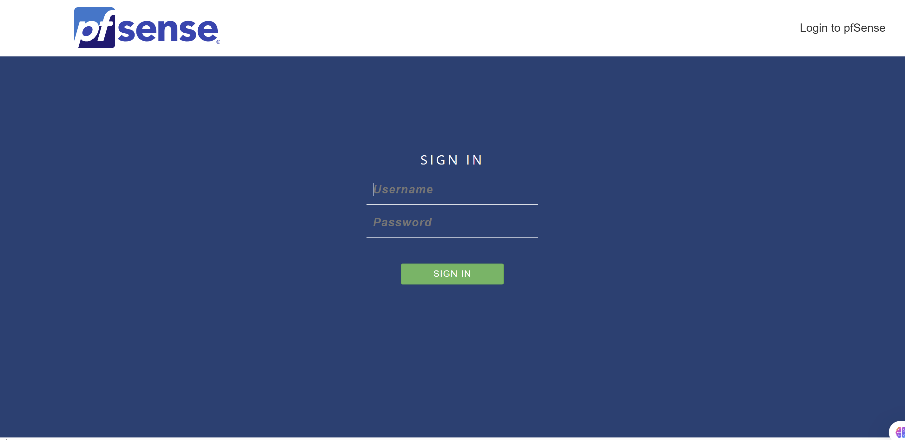
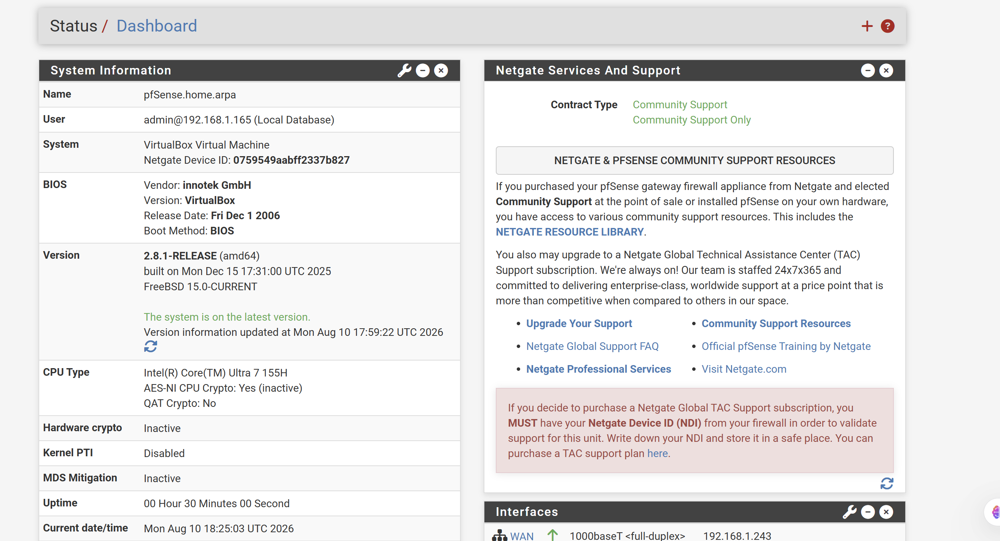
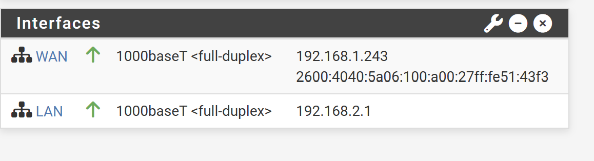

# Setting Up pfSense Firewall

## What is pfSense?

pfSense is a free open source firewall and router 
based on FreeBSD. It provides enterprise grade 
firewall features including traffic filtering, 
NAT, VPN and network segmentation. In this home 
lab pfSense acts as the firewall between the 
internal VM network and the home network.

## Why pfSense?

pfSense was chosen for this home lab because it:

- Is free and open source
- Provides real world firewall experience
- Is widely used in enterprise environments
- Supports advanced firewall rules and NAT
- Integrates with Wazuh for security monitoring
- Is directly relevant to SOC analyst work

## Network Architecture

With pfSense added the home lab network looks like:

```
Internet
    ↓
Verizon Router (192.168.1.1)
    ↓
pfSense Firewall
WAN: 192.168.1.243
LAN: 192.168.2.1
    ↓
Internal VM Network (192.168.2.0/24)
    ├── Ubuntu VM
    ├── Kali Linux VM
    └── DVWA (coming Phase 5)
```

## System Requirements

### pfSense VM Specifications
- OS: pfSense 2.8.1
- RAM: 1GB minimum
- Storage: 10GB minimum
- Network Adapters: 2
  - Adapter 1 (WAN): Bridged Adapter
  - Adapter 2 (LAN): Internal Network

---

## Part 1: Installing pfSense

### Step 1: Download pfSense

Go to [pfsense.org](https://www.pfsense.org/download/) 
and download the latest pfSense ISO file.

Select:
- **Architecture:** AMD64
- **Installer:** DVD Image (ISO)
- **Mirror:** closest to your location

### Step 2: Create pfSense VM in VirtualBox

Create a new VM in VirtualBox with these settings:

- **Name:** pfsense00
- **Type:** BSD
- **Version:** FreeBSD (64-bit)
- **RAM:** 1024 MB (1GB)
- **Storage:** 10GB
- **Hard Disk Format:** VDI

> Note: For detailed steps on creating a VM 
> refer to the 
> [Ubuntu VM Installation Guide](ubuntu-vm-install.md)

### Step 3: Configure Network Adapters

pfSense requires two network adapters:

**Adapter 1 (WAN):**
1. Go to VM **Settings → Network → Adapter 1**
2. Check **Enable Network Adapter**
3. Attached to: **Bridged Adapter**
4. Select your WiFi adapter name

**Adapter 2 (LAN):**
1. Click **Adapter 2** tab
2. Check **Enable Network Adapter**
3. Attached to: **Internal Network**
4. Name: **intnet**

> Note: The VM must be powered off before 
> changing network adapter settings.

### Step 4: Install pfSense

1. Start the VM with the pfSense ISO mounted
2. Follow the installation wizard
3. Accept all default settings
4. Select **Install pfSense**
5. Choose **Auto (ZFS)** partition scheme
6. Wait for installation to complete
7. Remove the ISO and reboot

---

## Part 2: Initial Configuration

### Step 1: Assign Interfaces

After booting you will see the pfSense console menu.

At the top of the screen check the interface status:

```
WAN → em0 → your IP address
LAN → em1 → not configured yet
```
Press **1** to assign interfaces:
- Type **n** when asked about VLANs
- WAN interface: type **em0**
- LAN interface: type **em1**
- Type **y** to confirm

### Step 2: Set LAN IP Address

Press **2** to set interface IP addresses:

1. Type **2** to select LAN
2. Enter IPv4 address:
```
192.168.2.1
```
3. Enter subnet bit count:
```
24
```
4. Press **Enter** to skip upstream gateway
5. Press **Enter** to skip IPv6
6. Type **y** to enable DHCP server
7. DHCP start address:
```
192.168.2.100
```
8. DHCP end address:
```
192.168.2.200
```
9. Type **y** to allow HTTP web access

After configuration the console should show:

9. Type **y** to allow HTTP web access

After configuration the console should show:
```
WAN → 192.168.1.243
LAN → 192.168.2.1
```
### Step 3: Enable WAN Web Access

By default pfSense blocks web GUI access from 
the WAN side. To enable it for home lab access 
run the following from the pfSense shell.

Press **8** for Shell and type:

```bash
pfSsh.php playback enableallowallwan
```

You should see:
```
Adding allow rule
Turning off block private networks
```
Type **exit** to return to the console menu.

### Step 4: Access pfSense Dashboard

Open your laptop browser and go to:

`http://192.168.1.243`

**Default credentials:**
```
Username: admin
Password: pfsense
```
> **Security Warning:** Change the default 
> password immediately after first login!


<p><em>pfSense web interface login page</em></p>

### Step 5: Change Default Password

1. Click **System** in top menu
2. Click **User Manager**
3. Click the **pencil/edit icon** next to admin
4. Scroll down to password fields
5. Enter your new strong password
6. Confirm password
7. Click **Save**

> Note: Store your password securely in 
> your password manager.

### Step 6: Explore the Dashboard

After logging in you will see the pfSense 
dashboard showing:

- System information
- Interface status (WAN and LAN)
- Traffic graphs
- Firewall logs



<p><em>pfSense dashboard showing system information and interface status</em></p>


**Interface Status:**

| Interface | IP Address | Status |
|---|---|---|
| WAN | 192.168.1.243 | Active |
| LAN | 192.168.2.1 | Active |

---

## Where We Stopped

pfSense is now installed and accessible via 
the web dashboard. The next steps are:

- Configure firewall rules
- Set up NAT rules
- Integrate pfSense logs with Wazuh
- Test traffic filtering

These will be covered in the next session.

---

## Troubleshooting

### Cannot Access Web Dashboard

If you cannot access `http://192.168.1.243` 
from your browser:

1. Verify pfSense VM is running in VirtualBox
2. Verify Adapter 1 is set to **Bridged**
3. Run the WAN access command from shell:

```bash
pfSsh.php playback enableallowallwan
```

### Interfaces Not Showing

If WAN or LAN are not showing IP addresses:

1. Press **1** to reassign interfaces
2. Press **2** to set IP addresses manually
3. Verify network adapters in VirtualBox settings

### Cannot Change Network Adapter Settings

VirtualBox does not allow changing network 
settings while VM is running:

1. Power off the VM first
2. Go to Settings → Network
3. Make your changes
4. Start the VM again

