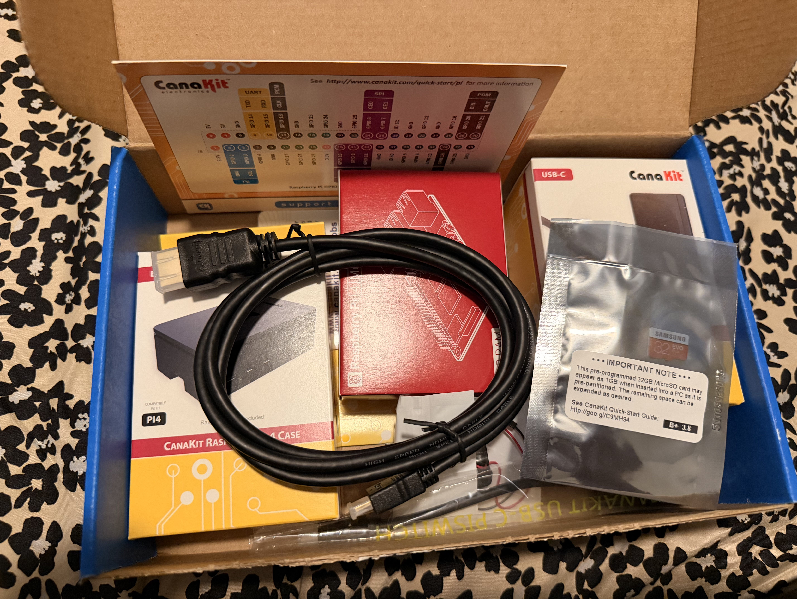
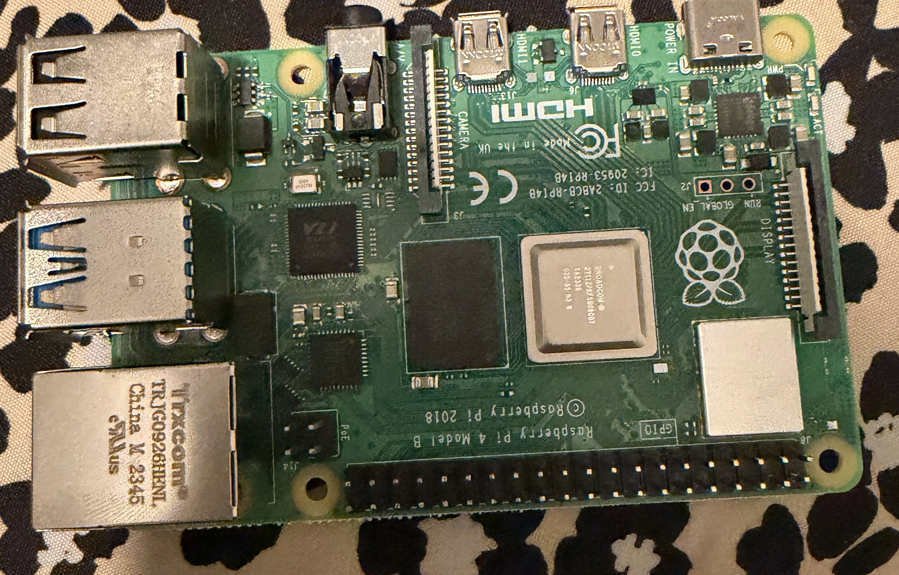
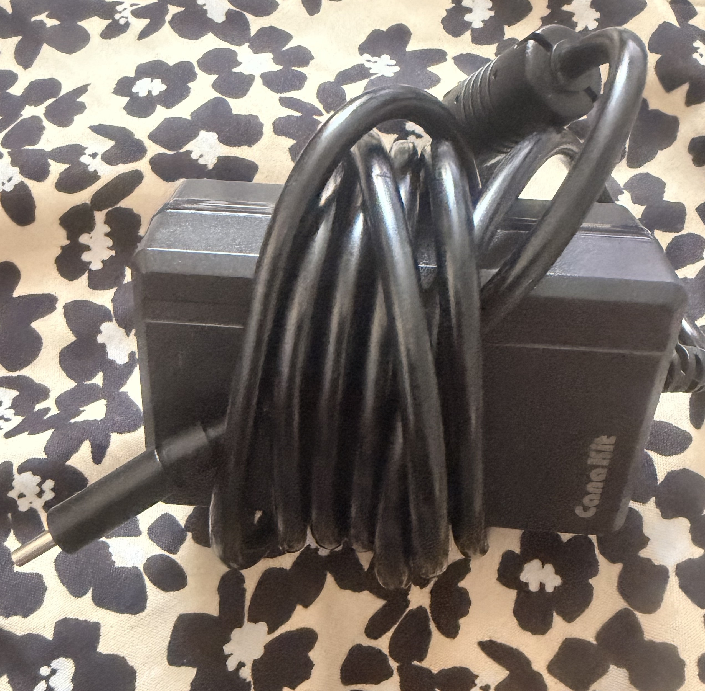
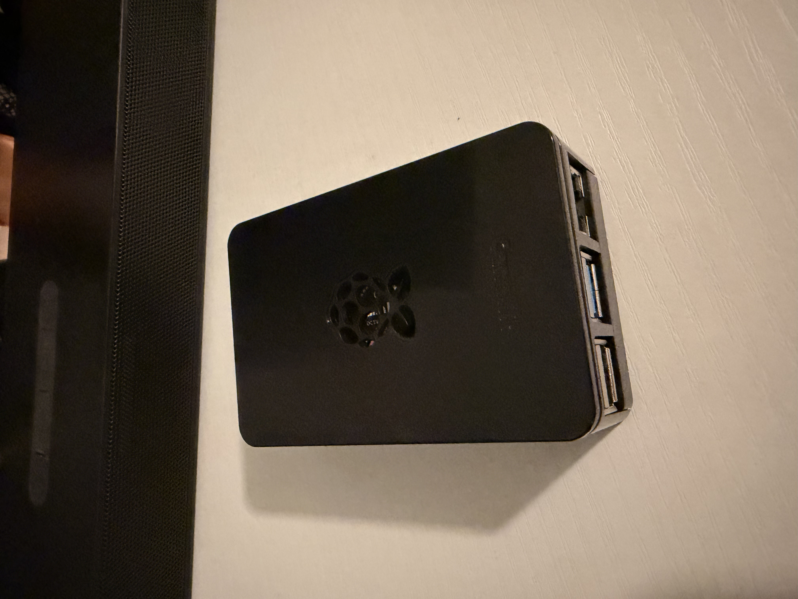
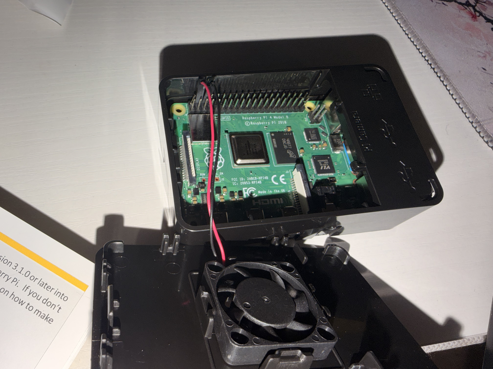
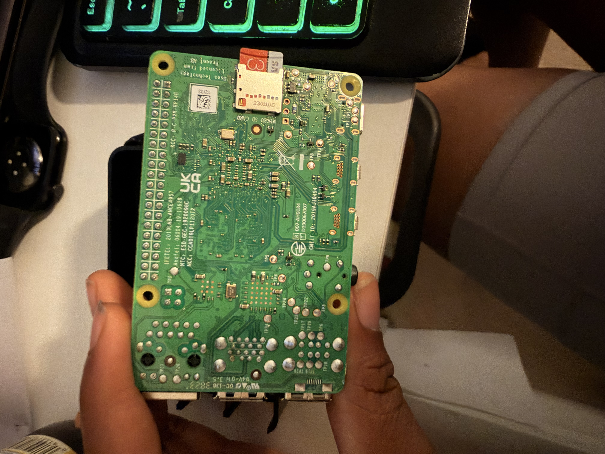
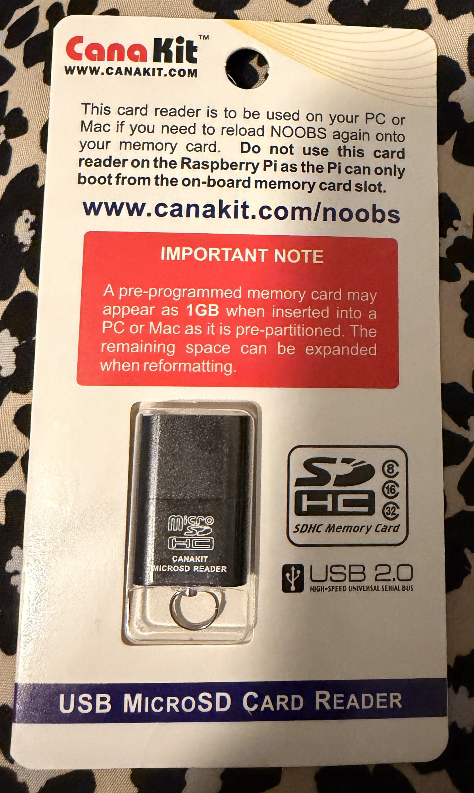
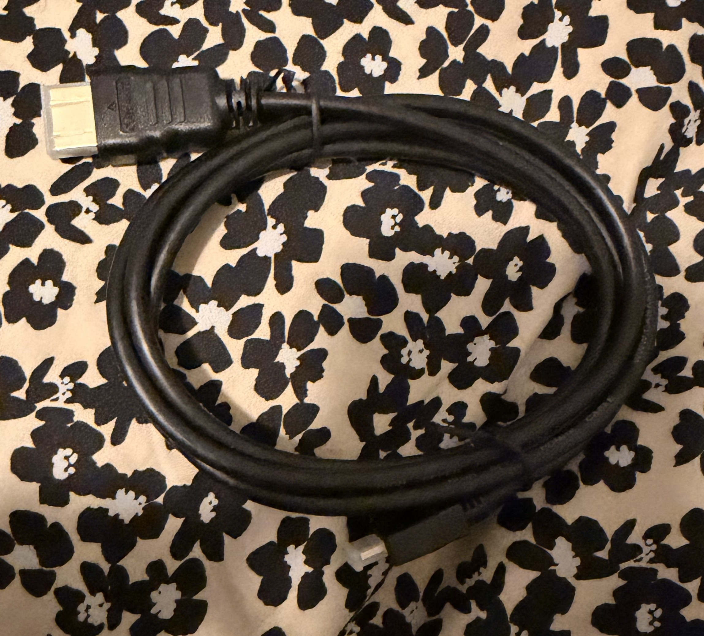
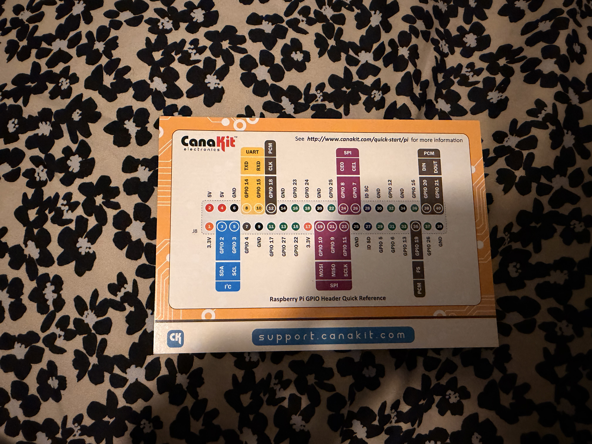

# Setting Up Pi-hole on Raspberry Pi 4

## What is a Raspberry Pi?
A Raspberry Pi is a small, affordable single-board computer that can be used for a variety of projects including home automation, media centers, retro gaming, and network security tools.

## Whats is a Pi-hole?
Pi-hole is a free, open-source application that turns your Raspberry Pi into a network-wide DNS server and ad blocke. It filters all DNS requests on your network, blocking ads, trackers and malicious domains before they reach your devices.

## Why Pi-hole?
Pi-hole was chosen for this home lab project because it:

- Provides real world DNS monitoring experience
- Blocks ads and trackers at the network level affecting all devices on the network
- Gives visibility into all DNS queries on the network
- Is directly relevant to SOC analyst work
- Runs efficiently on a raspberry Pi 4

## Hardware Requirements

The following hardware was used in this project:

- Raspberry Pi 4 Model B (4GB RAM)
- CanaKit USB-C Power Supply
- CanaKit Black Case
- Cooling Fan
- 32GB Samsung MicroSD Card
- USB MicroSD Card Reader
- HDMI Cable
- GPIO Reference Card
- PiSwitch (On/Off Switch)

<em>Raspberry Pi 4 Model B 4GB RAM box</em>

<em>Raspberry Pi 4 Model B board showing all ports and GPIO pins</em>

<em>CanaKit USB-C power supply used to power the Raspberry Pi 4</em>

<em>CanaKit black case compatible with Raspberry Pi 4</em>

<em>CanaKit cooling fan connected to GPIO pins to prevent overheating</em>

<em>32GB Samsung MicroSD card used as the Raspberry Pi storage</em>

<em>USB MicroSD card reader used to flash the OS from laptop</em>

<em>HDMI cable used for initial Pi setup and display connection</em>

<em>CanaKit GPIO reference card used to identify correct pins for fan connection</em>
