# Setting Up Pi-hole on Raspberry Pi 4

## Network Overview
This setup is part of a larger home lab project. 
See the full network topology diagram below:


## What is a Raspberry Pi?
A Raspberry Pi is a small, affordable single-board computer that can be used for a variety of projects including home automation, media centers, retro gaming, and network security tools.

## Whats is a Pi-hole?
Pi-hole is a free, open-source application that turns your Raspberry Pi into a network-wide DNS server and ad blocke. It filters all DNS requests on your network, blocking ads, trackers and malicious domains before they reach your devices.

## Why Pi-hole?
Pi-hole was chosen for this home lab project because it:

- Provides real world DNS monitoring experience
- Blocks ads and trackers at the network level affecting all devices on the network
- Gives visibility into all DNS queries on the network
- Is directly relevant to SOC analyst work
- Runs efficiently on a raspberry Pi 4

## Hardware Requirements

The following hardware was used in this project:

- Raspberry Pi 4 Model B (4GB RAM)
- CanaKit USB-C Power Supply
- CanaKit Black Case
- Cooling Fan
- 32GB Samsung MicroSD Card
- USB MicroSD Card Reader
- HDMI Cable
- GPIO Reference Card
- PiSwitch (On/Off Switch)


<p><em>Raspberry Pi 4 Model B 4GB RAM box</em></p>


<p><em>Raspberry Pi 4 Model B board showing all ports and GPIO pins</em></p>


<p><em>CanaKit USB-C power supply used to power the Raspberry Pi 4</em></p>


<p><em>CanaKit black case compatible with Raspberry Pi 4</em></p>


<p><em>CanaKit cooling fan connected to GPIO pins to prevent overheating</em></p>


<p><em>32GB Samsung MicroSD card used as the Raspberry Pi storage</em></p>


<p><em>USB MicroSD card reader used to flash the OS from laptop</em></p>


<p><em>HDMI cable used for initial Pi setup and display connection</em></p>


<p><em>CanaKit GPIO reference card used to identify correct pins for fan connection</em></p>


## Part 1: Installing Raspberry Pi Imager

The MicroSD card that came with the CanaKit package was 
pre-programmed with an operating system. However a fresh 
installation was performed to ensure the latest version 
of Raspberry Pi OS was used.

### Step 1: Download Raspberry Pi Imager

Go to [raspberrypi.com/software](https://www.raspberrypi.com/software/) 
and download the Raspberry Pi Imager for Windows.

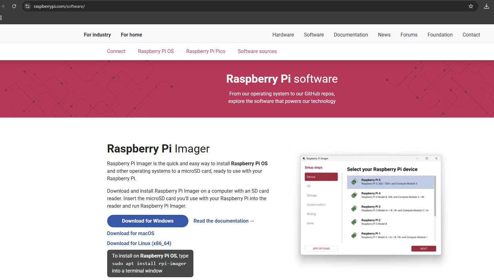
<p><em>Raspberry Pi Imager download page showing Windows option selected</em></p>

### Step 2: Install Raspberry Pi Imager

Run the downloaded installer and follow the setup wizard 
keeping all default settings. Click Next through each screen.

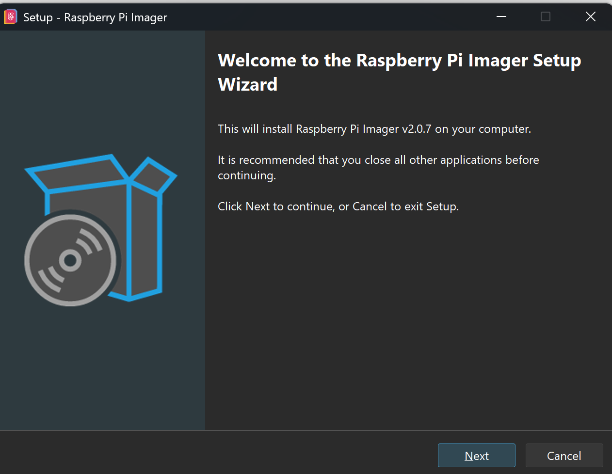
<p><em>Raspberry Pi Imager installation progress</em></p>

### Step 3: Installation Complete

Once installation is complete click Finish to launch 
Raspberry Pi Imager.

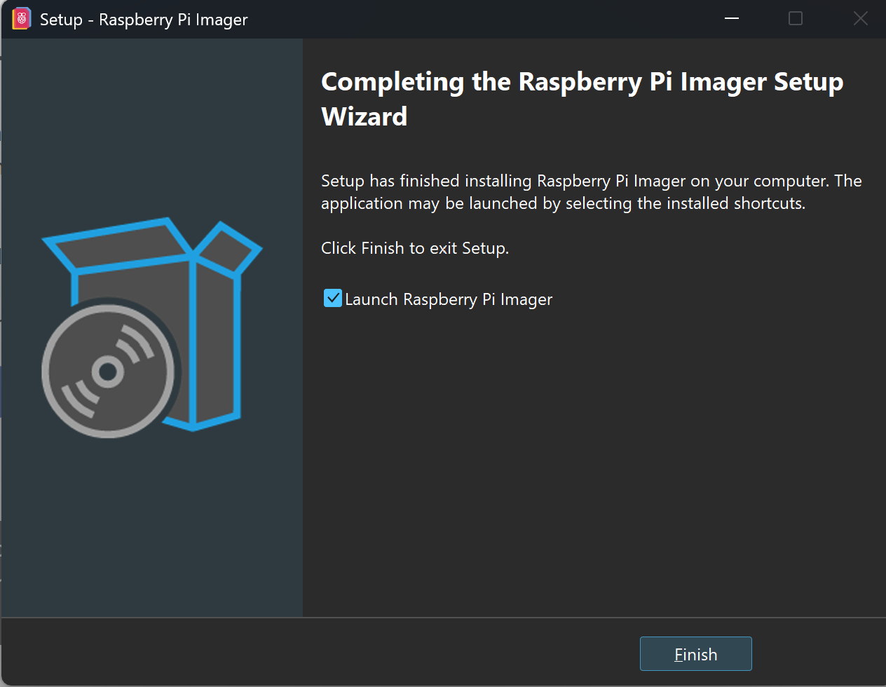
<p><em>Raspberry Pi Imager setup wizard completion screen</em></p>

## Part 2: Flashing Raspberry Pi OS

Raspberry Pi Imager v2.0.7 uses a step by step 
setup process shown on the left side panel:
- Device
- OS
- Storage
- Customisation
- Writing
- Done

### Step 1: Select Your Device

On the Device screen select Raspberry Pi 4 from the list.

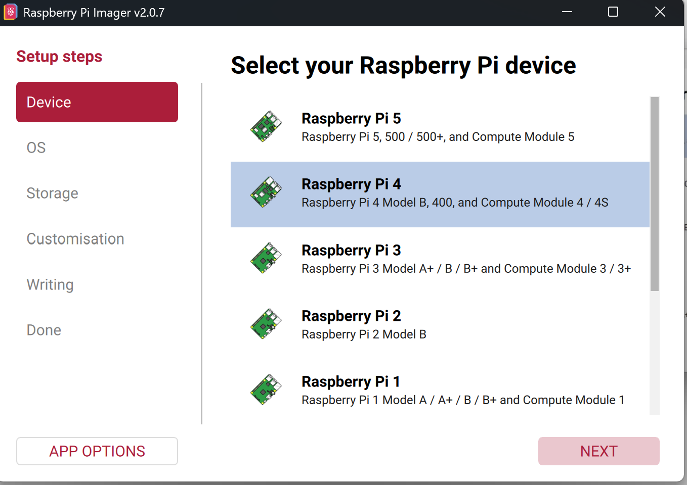
<p><em>Selecting Raspberry Pi 4 as the target device</em></p>

### Step 2: Choose Operating System

On the OS screen select Raspberry Pi OS (64-bit) 
— this is the recommended option at the top of the list.

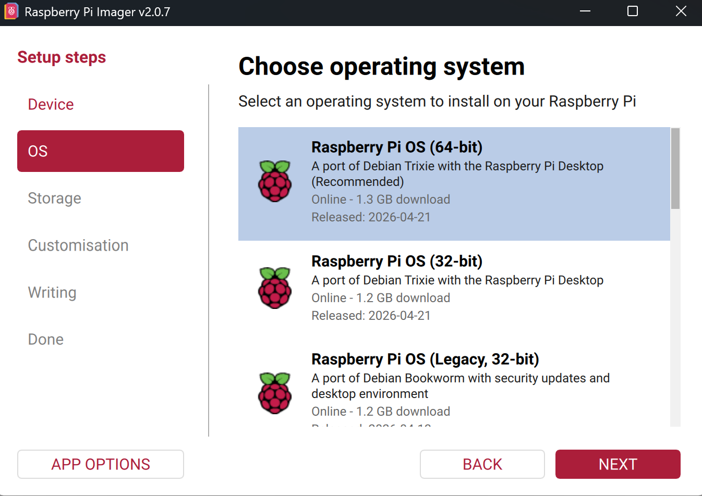
<p><em>Selecting Raspberry Pi OS 64-bit as the operating system</em></p>

### Step 3: Select Storage Device

On the Storage screen select your MicroSD card. 
It should appear as Mass Storage Device USB around 
29.8GB. Leave Exclude System Drives checked.

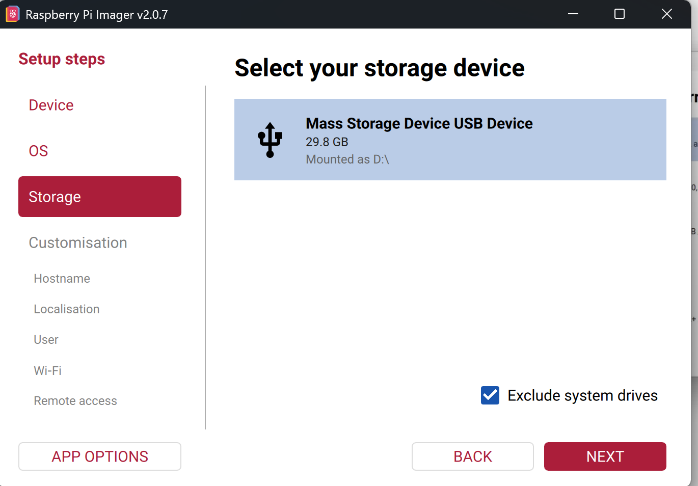
<p><em>Selecting the 32GB MicroSD card as the storage device</em></p>

### Step 4: Customisation - Hostname

On the Customisation screen set your hostname. 
The hostname is the name your Raspberry Pi will 
use to identify itself on the network. 
Leave it as the default raspberrypi or choose 
your own. For this guide we used raspberrypi.

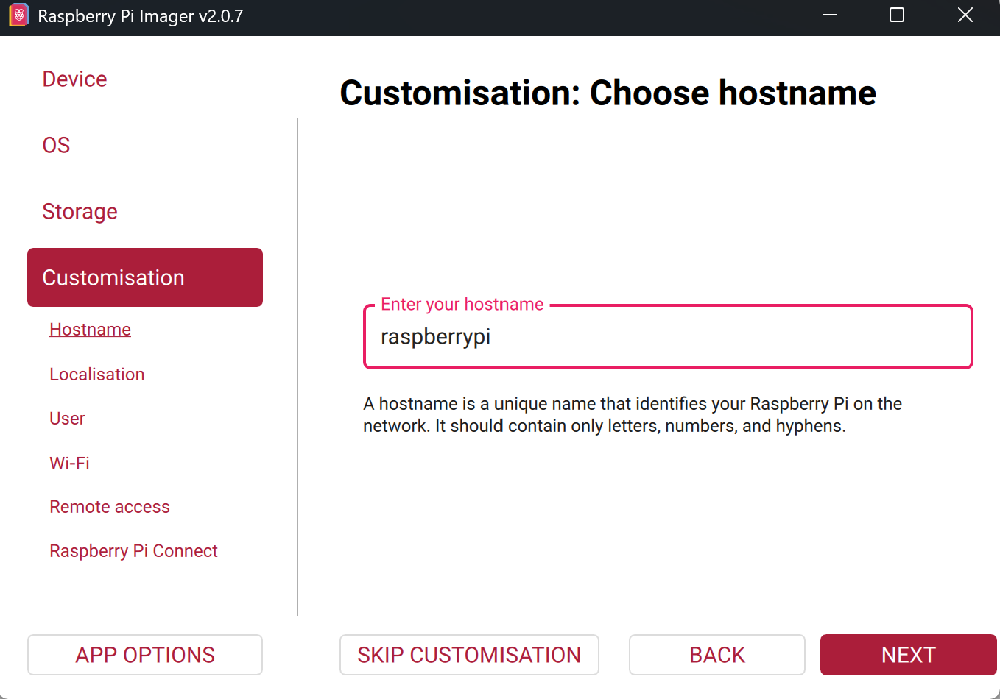
<p><em>Setting the hostname for the Raspberry Pi</em></p>

### Step 5: Customisation - Localisation

Set your timezone and keyboard layout. 
For this guide we selected America/New_York 
as the timezone and US as the keyboard layout.

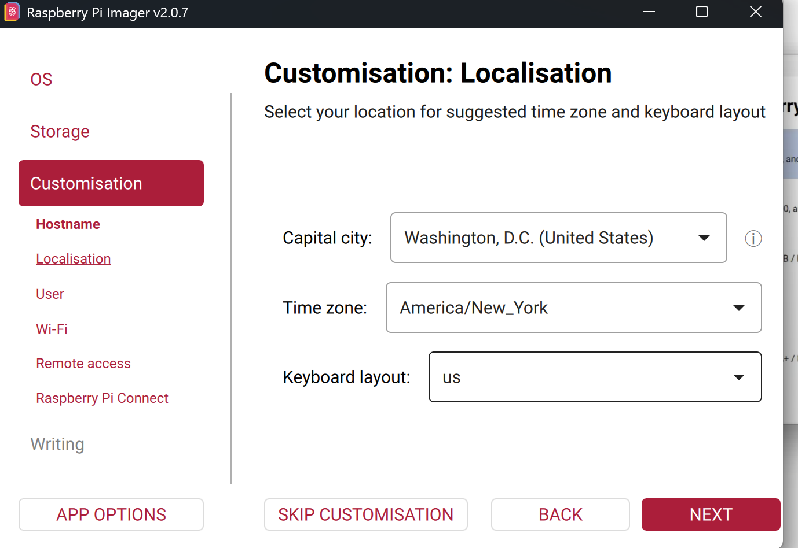
<p><em>Setting timezone and keyboard layout</em></p>

### Step 6: Customisation - Username

Create a username and password for your Raspberry Pi. 
Use all lowercase with no spaces. For this guide we 
used homelab as the username. Choose a password 
you will remember as you will need it to SSH into the Pi.

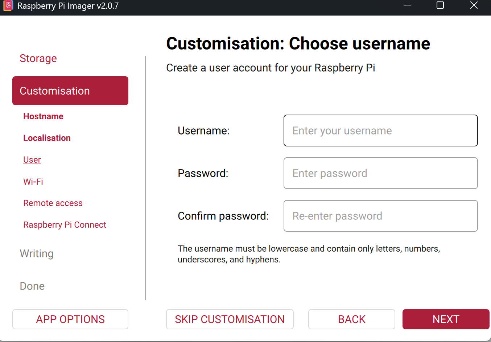
<p><em>Creating a username and password for the Raspberry Pi</em></p>

### Step 7: Customisation - WiFi

Enter your home WiFi network name and password 
so the Pi connects automatically on first boot. 
Leave Hidden SSID unchecked unless your network 
is hidden.

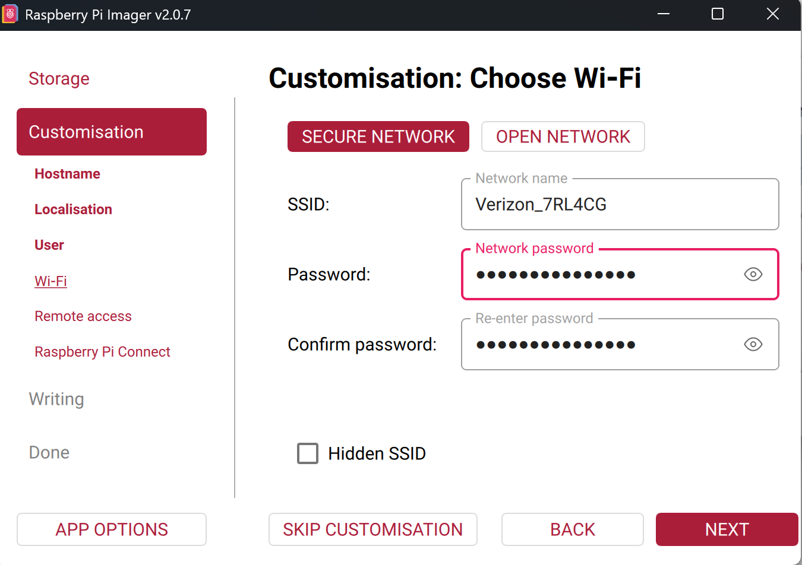
<p><em>Configuring WiFi credentials for automatic network connection</em></p>

### Step 8: Customisation - SSH

Enable SSH by toggling it on and select 
Use password authentication. This allows you 
to control the Pi remotely from your laptop 
without needing a monitor or keyboard connected.

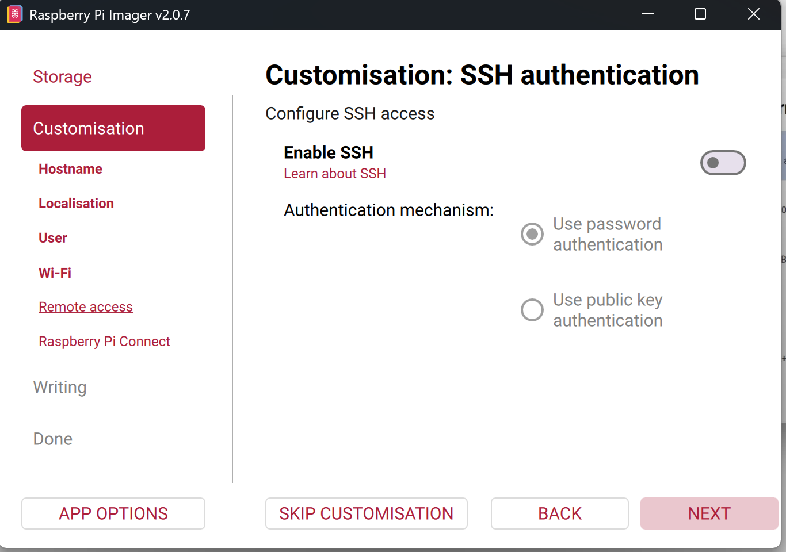
<p><em>Enabling SSH access with password authentication</em></p>

### Step 9: Raspberry Pi Connect

Leave Raspberry Pi Connect disabled. We will 
use SSH directly instead.

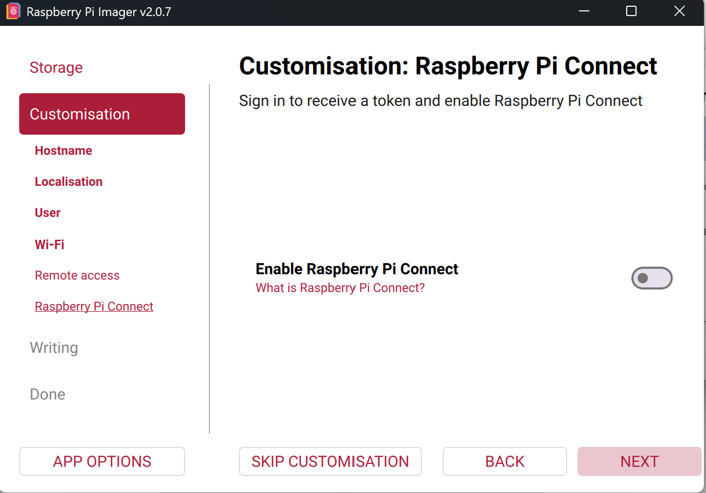
<p><em>Raspberry Pi Connect left disabled</em></p>

### Step 10: Write Image

Review your settings on the Write Image screen 
and click Write. A confirmation dialog will appear 
warning that all data on the MicroSD card will be 
erased. Click I Understand Erase and Write to proceed.

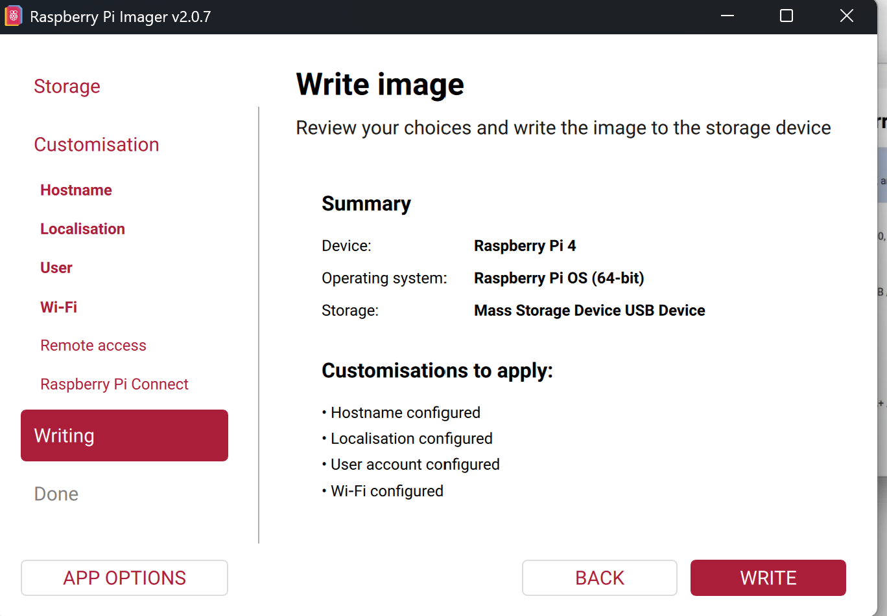
<p><em>Review screen showing all customisations before writing</em></p>

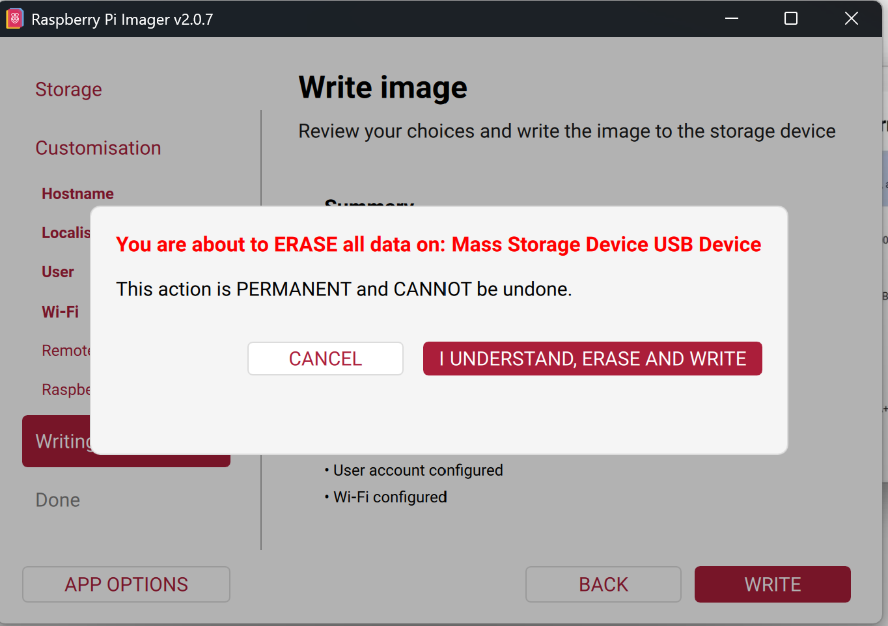
<p><em>Confirmation dialog before erasing and writing to MicroSD card</em></p>

### Step 11: Write Complete

Once writing is complete you will see the Write 
Complete screen confirming all customisations 
were applied. The MicroSD card is automatically 
ejected and is ready to be inserted into the Pi.

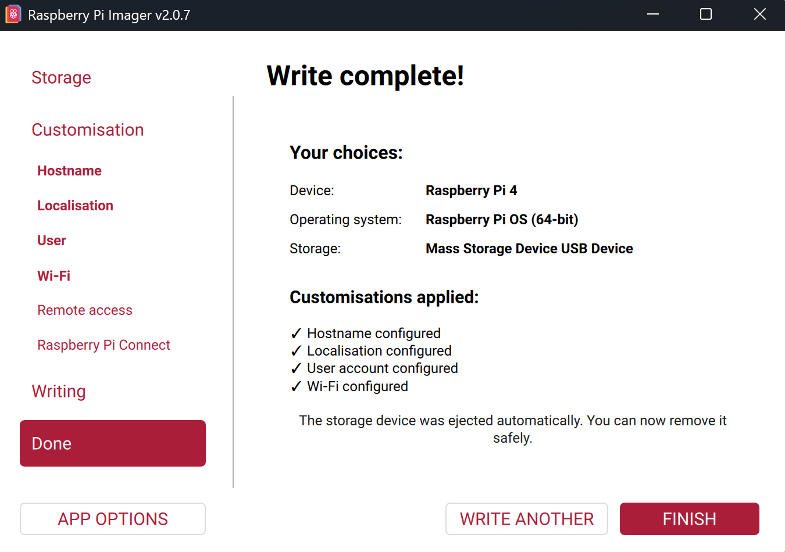
<p><em>Write complete screen confirming successful OS installation</em></p>

## Part 3: Assembling the Raspberry Pi

### Step 1: Place Pi into Case
Open the CanaKit case and place the Raspberry Pi 4 
board into the bottom half of the case. The ports 
should align with the openings on the side of the case.

### Step 2: Connect the Cooling Fan
Using the GPIO reference card identify pins 4 and 6 
on the GPIO header. Connect the fan connector to these 
pins with the red wire on pin 4 (5V) and the black 
wire on pin 6 (GND). The fan prevents the Pi from 
overheating during extended use.

### Step 3: Insert the MicroSD Card
Flip the Pi over and locate the MicroSD card slot 
on the bottom edge of the board. Insert the flashed 
MicroSD card with the gold contacts facing down until 
it clicks into place.

### Step 4: Close the Case
Snap the top lid of the case onto the bottom half 
until it clicks securely into place.

### Step 5: Connect Cables
Connect the following cables to the Pi:
- HDMI cable to the micro HDMI port closest to the USB-C port
- USB keyboard and mouse
- USB-C power supply last

## Part 5: Installing Pi-hole

### Step 1: Run the Pi-hole Installer

In your SSH terminal run the following command:

```bash
curl -sSL https://install.pi-hole.net | bash
```

The Pi-hole Automated Installer will launch.

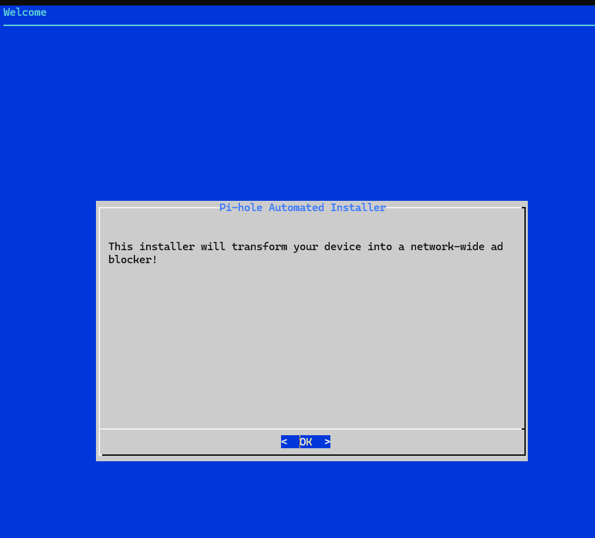
<p><em>Pi-hole Automated Installer welcome screen</em></p>

### Step 2: Static IP Warning

The installer will warn you that Pi-hole needs a 
static IP address to function properly. Click 
Continue to proceed.

### Step 3: Choose Network Interface

Select wlan0 as the network interface since the 
Pi is connected via WiFi. Press Space to select 
it then Enter to confirm.

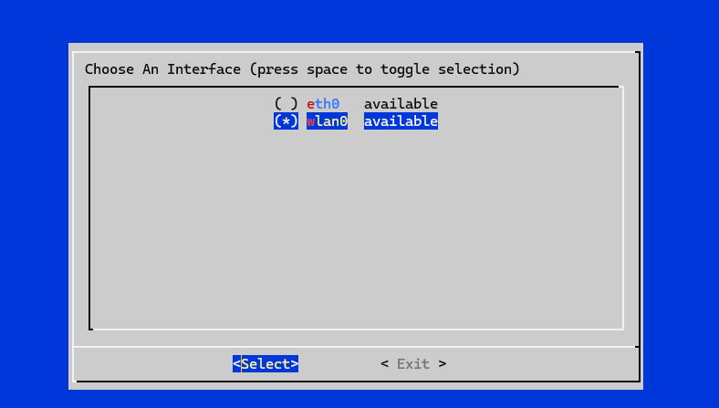
<p><em>Selecting wlan0 as the network interface</em></p>

### Step 4: Select Upstream DNS Provider

Select Cloudflare (DNSSEC) as the upstream DNS 
provider. Cloudflare offers fast, privacy focused 
DNS with DNSSEC validation which verifies DNS 
responses are legitimate and have not been tampered with.

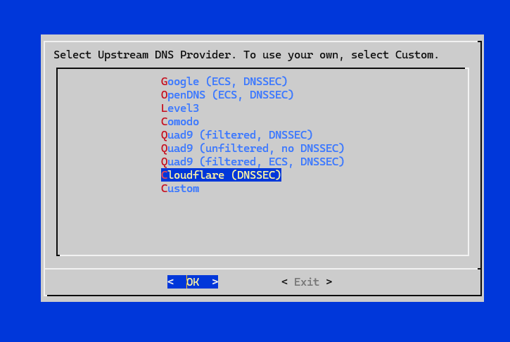
<p><em>Selecting Cloudflare with DNSSEC as the upstream DNS provider</em></p>

### Step 5: Enable Blocklist

Select Yes to include StevenBlack's Unified Hosts 
List. This blocklist contains over 84,000 known ad 
and tracking domains that Pi-hole will block automatically.

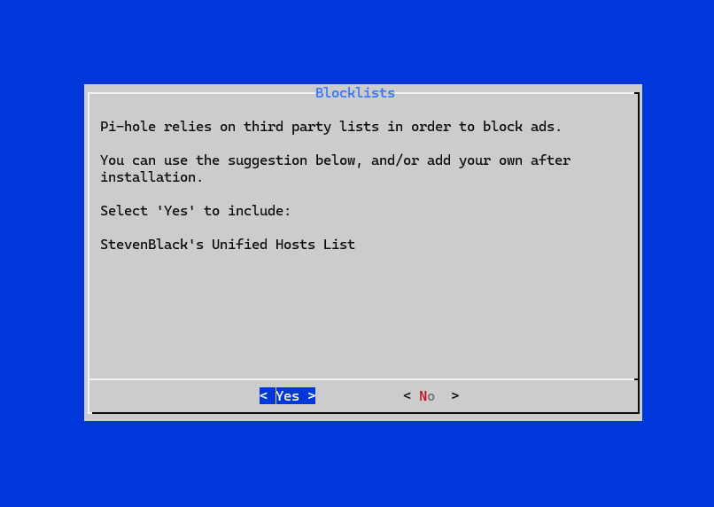
<p><em>Enabling StevenBlack's Unified Hosts blocklist</em></p>

### Step 6: Enable Query Logging

Select Yes to enable query logging. This allows 
Pi-hole to record all DNS queries made on your 
network giving you full visibility into what 
devices are connecting to.

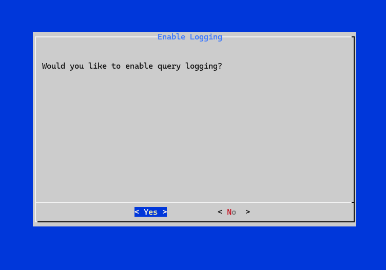
<p><em>Enabling DNS query logging for network monitoring</em></p>

### Step 7: Privacy Mode

Select Show Everything (option 0) to see all DNS 
queries from all devices on your network. This gives 
maximum visibility for monitoring purposes.

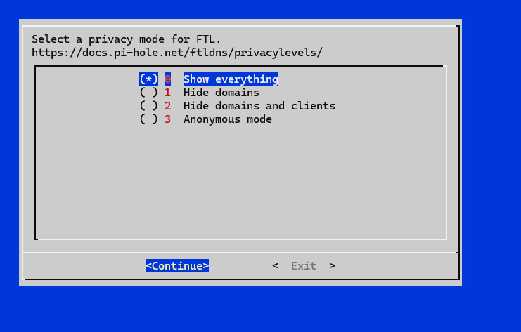
<p><em>Setting privacy mode to Show Everything for full network visibility</em></p>

### Step 8: Installation Complete

Pi-hole will complete the installation and display 
a summary showing your Pi's IP addresses and admin 
dashboard URL. Note down your admin password shown 
on this screen.

> Note: The admin password shown on this screen 
> has been blurred for security purposes.

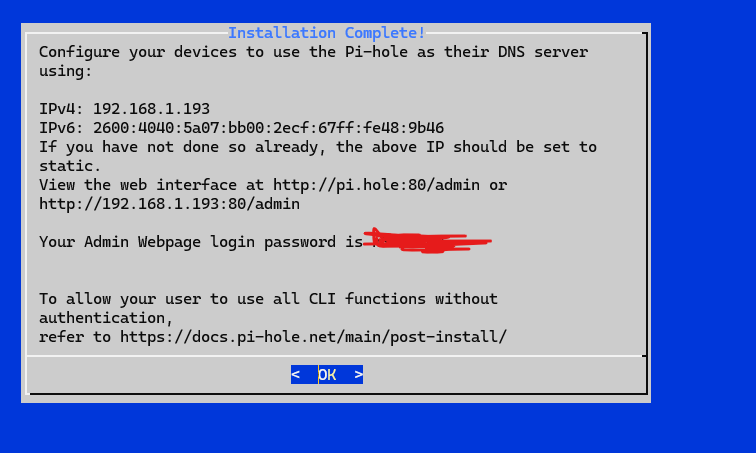
<p><em>Pi-hole installation complete showing IPv4 and IPv6 addresses</em></p>

## Part 6: Setting Up Admin Access

### Step 1: SSH Back into the Pi

After installation SSH back into your Pi from 
your laptop terminal:

```bash
ssh username@192.168.1.193
```

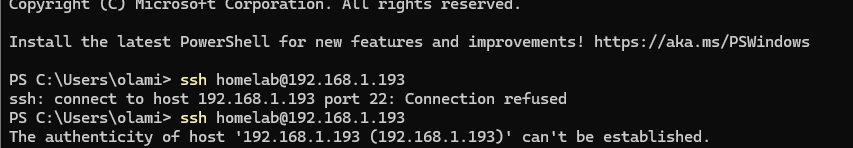
<p><em>SSH terminal connected to Raspberry Pi from laptop</em></p>

### Step 2: Verify Connection

Once connected you will see the terminal prompt 
confirming you are logged into the Raspberry Pi 
as the homelab user.

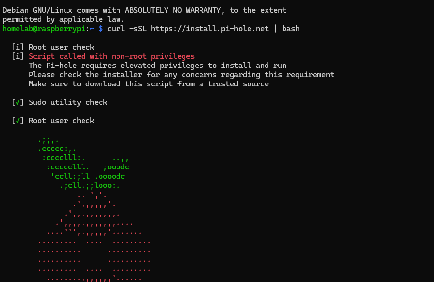
<p><em>Successfully connected to Raspberry Pi via SSH</em></p>

### Step 3: Confirm Installation Complete

The terminal confirms Pi-hole is fully installed 
and running.

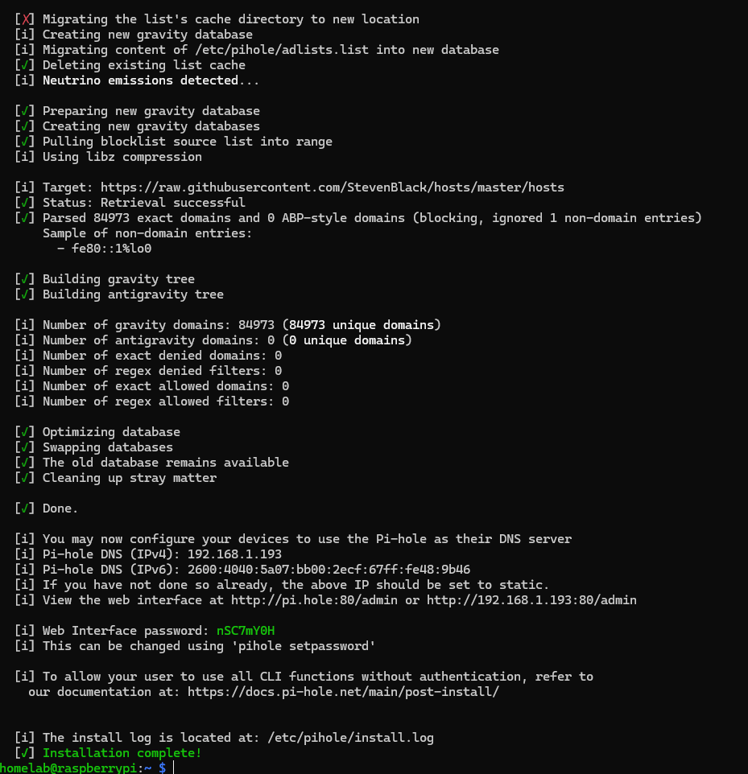
<p><em>Terminal confirming Pi-hole installation is complete</em></p>

### Step 4: Reset Admin Password

Reset the Pi-hole admin password using the 
following command:

```bash
sudo pihole setpassword
```

You will be prompted to enter and confirm your 
new password. Choose a strong password you will 
remember as you will need it to log into the 
Pi-hole dashboard.

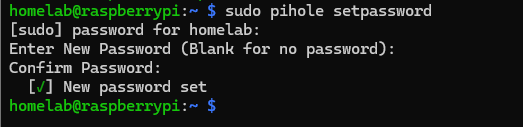
<p><em>Resetting Pi-hole admin password via SSH terminal</em></p>

## Part 7: Accessing the Pi-hole Dashboard

### Step 1: Open the Admin Login Page

On your laptop open your browser and go to:

[http://YOUR-PI-IP-ADDRESS/admin](http://YOUR-PI-IP-ADDRESS/admin)

Replace `YOUR-PI-IP-ADDRESS` with the IP address 
you found earlier using the `ip a` command on your Pi. 

For example if your Pi's IP address is `192.168.1.193` 
you would go to:

[http://192.168.1.193/admin](http://192.168.1.193/admin)

You will see the Pi-hole login page. Enter the 
password you set in the previous step.

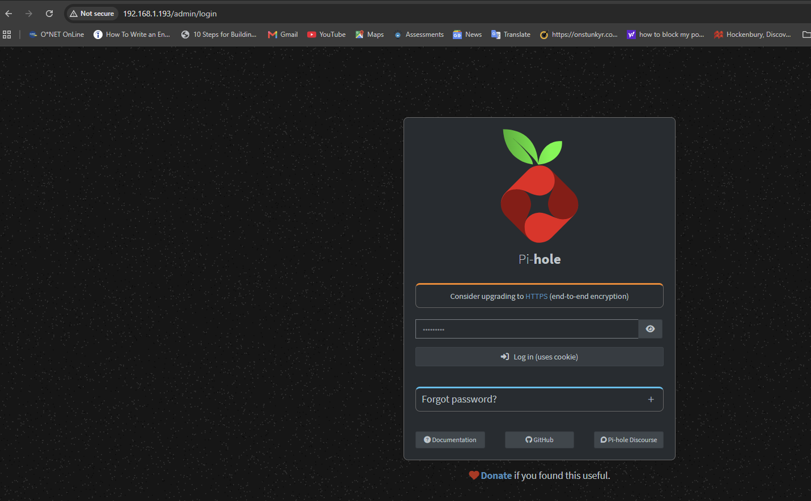
*Pi-hole admin login page accessed from laptop browser*

## Part 8: Configuring DNS on Your Laptop

To route your laptop's DNS traffic through Pi-hole 
you need to manually set your DNS server to your 
Pi's IP address.

### Step 1: Open Network Settings

1. Click the **Start menu**
2. Go to **Settings**
3. Click **Network & Internet**
4. Click **WiFi**
5. Click on your connected WiFi network

### Step 2: Change DNS Settings

1. Scroll down to **DNS server assignment**
2. Click **Edit**
3. Change from **Automatic** to **Manual**
4. Turn on **IPv4**
5. Set **Preferred DNS** to your Pi's IP address:

`192.168.1.193`

6. Set **Alternate DNS** to:

`8.8.8.8`

7. Click **Save**

> Note: The alternate DNS `8.8.8.8` is Google's 
> DNS server. This acts as a backup in case 
> Pi-hole goes offline so your internet 
> continues to work.

### Step 3: Verify Pi-hole is Working

Open your browser and visit any website. Then 
go back to your Pi-hole dashboard at:

[http://192.168.1.193/admin](http://192.168.1.193/admin)

You should see DNS queries appearing in real 
time on the dashboard confirming your laptop 
traffic is now going through Pi-hole.

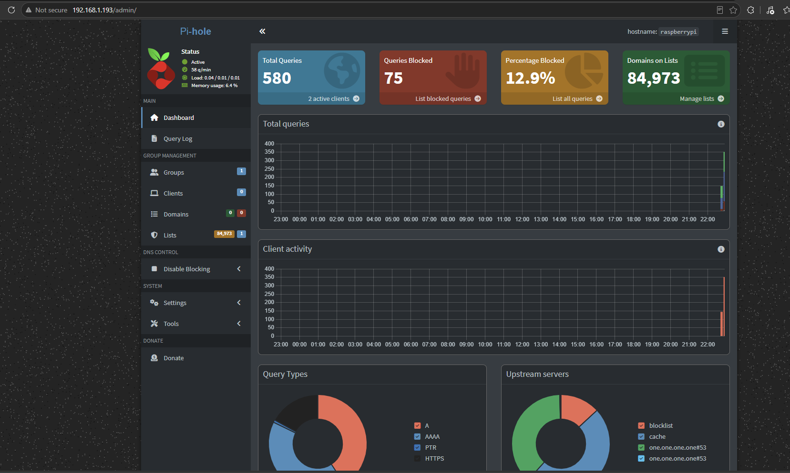
*Pi-hole dashboard showing real time DNS queries from laptop*

## Troubleshooting

### Issue 1: Forgot Admin Password

If you forget your Pi-hole admin password you can 
reset it by SSHing into your Pi and running:

```bash
sudo pihole setpassword
```

You will be prompted to enter and confirm a new password.

### Issue 2: Black Screen or Frozen Screen

If your Pi screen freezes or stays black for more 
than 15 minutes do the following:

1. Click the **File** tab at the top of the VM window
2. Click **Close**
3. Select **Save the machine state** and click **OK**
4. Go back to VirtualBox Manager
5. Select your VM and click **Start** to restart it

This will resume your VM from where it left off 
and should fix the frozen screen issue.

### Issue 3: Internet Not Working After Setting DNS

If your internet stops working after setting Pi-hole 
as your DNS server it may mean your Pi is offline. 
To fix it temporarily:

1. Go to **Settings → Network & Internet → WiFi**
2. Click your network → **Edit DNS**
3. Change back to **Automatic**
4. Your internet will work again using your router's DNS

Turn your Pi back on and reconfigure the DNS 
settings once it is running again.

### Issue 4: Pi-hole Dashboard Not Loading

If you cannot access the dashboard at 
[http://192.168.1.193/admin](http://192.168.1.193/admin) check that:

- Your Pi is powered on
- Your Pi is connected to WiFi
- Your laptop DNS is set to `192.168.1.193`
- Try pinging the Pi from your laptop:

```bash
ping 192.168.1.193
```

If there is no response your Pi is either off 
or not connected to the network.


## Security Best Practices

### Admin Password
Always set a strong admin password for your 
Pi-hole dashboard. Leaving it without a password 
means anyone on your network can access and 
modify your DNS settings.

To set or reset your password SSH into your Pi and run:

```bash
sudo pihole setpassword
```

> **Security Warning:** Use a password manager 
> like [Bitwarden](https://bitwarden.com) to store 
> your Pi-hole password securely so you never 
> forget it.

### Static IP Address
Pi-hole works best with a static IP address so 
its address never changes. If your Pi's IP address 
changes your DNS settings will stop working.

To set a static IP add the following to your 
Pi's DHCP configuration or reserve the IP in 
your router settings.

### Keep Pi-hole Updated
Regularly update Pi-hole to get the latest 
blocklists and security patches:

```bash
pihole -up
```

### Monitor Your Query Log
Regularly check your Pi-hole query log for 
suspicious domains. If you see devices connecting 
to unknown or suspicious domains investigate 
immediately — this could indicate malware on 
your network.