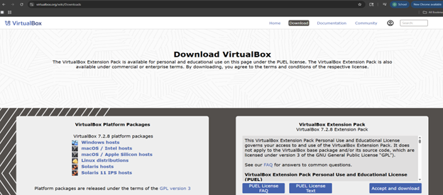
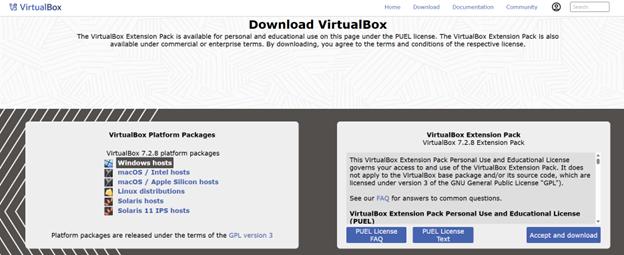
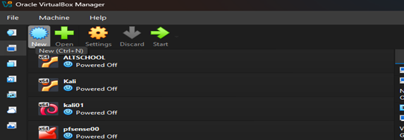
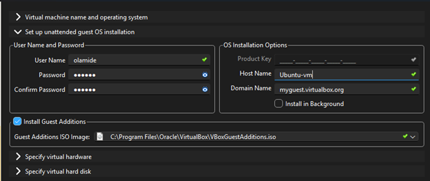
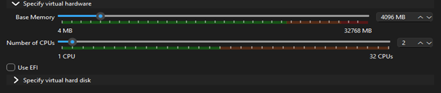
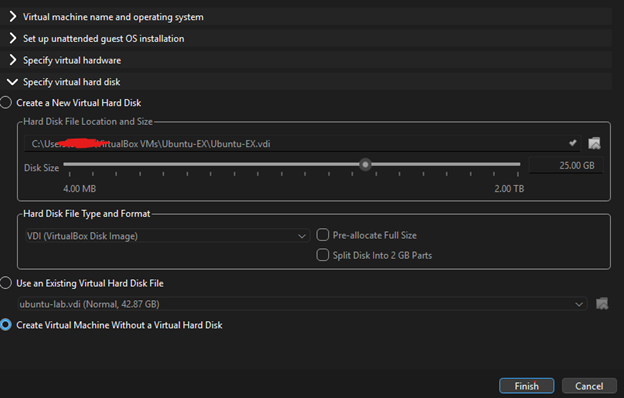
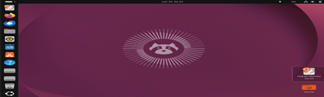

# Step-by-Step Guide to Installing a Virtual Machine

## What is a Virtual Machine?

A virtual machine (VM) is a software-based computer that runs inside your physical machine. It has its own operating system and behaves like a separate computer, but exists entirely within a window on your actual device.

---

## System Requirements For Virtual Machine

- Host Machine Operating System: Windows 11 64-bit
- Host Machine RAM: 32GB
- RAM Allocated to VM: 4GB
- Oracle VirtualBox (Virtualization Software)
- VM OS Distribution: Linux
- Operating Version on VM: Ubuntu 64-bit
- CPU on VM: 2
- Video Memory on VM: 128 MB
- Virtual Monitors on VM: 1
- Graphic Controller on VM: VBoxSVGA
- Installation File: Ubuntu ISO

---

## Part 1: Installing VirtualBox

**Step 1:** Go to [virtualbox.org](https://www.virtualbox.org) and click on the Download tab.

**Step 2:** After clicking the Download tab, select your host machine operating system under VirtualBox Platform Packages. Since this guide uses Windows, select **Windows hosts**.

**Step 3: Run the Installer**
After the file downloads, open it to launch the installer. A prompt will appear asking if you want to allow the app to make changes to your device, click **Yes**.

**Step 4: Follow the Installation Wizard**
The VirtualBox Setup Wizard will open. Click **Next** through the setup screens keeping all default settings as they are.

**Step 5: Accept the License Agreement**
When prompted, check the box to accept the license agreement and click **Next**.

**Step 6: Complete the Installation**
Continue clicking **Next** until you reach the final screen then click **Install**. Once the installation is complete click **Finish**.

**Step 7: Launch VirtualBox**
VirtualBox will now open automatically. You should see the VirtualBox Manager window — this is where you will create and manage your virtual machines.

---

## Part 2: Creating Your Virtual Machine

**Step 1:** Download the Ubuntu ISO. Go to [ubuntu.com/download/desktop](https://ubuntu.com/download/desktop) and click the Download button for the latest Ubuntu LTS version.

**Step 2:** Once downloaded, move the ISO file to a folder you can easily find later. Do not open or extract the file — VirtualBox will use it as is.

**Step 3:** Open VirtualBox and click the **New** button at the top of the VirtualBox Manager window to create a new virtual machine.

**Step 4: Virtual Machine Name and Operating System**

After clicking New, a setup window will appear. Fill in the following fields:

- VM Name: Give your virtual machine a name (example: Ubuntu-EX)
- VM Folder: Leave as default unless you want to save it somewhere specific
- ISO Image: Click the dropdown, select Other, and navigate to where you saved your Ubuntu ISO file and select it
- OS: Will auto-fill to Linux once ISO is selected
- OS Distribution: Will auto-fill to Ubuntu
- OS Version: Will auto-fill to Ubuntu (64-bit)
- Proceed with Unattended Installation: Leave this checked as it is selected by default

Once all fields are filled click **Next** to continue.

**Step 5: Set Up Unattended Installation**

Click the arrow next to Set up unattended guest OS installation to expand it. Fill in the following fields:

- Username: Enter a username in all lowercase with no spaces or special characters. Example: ubuntuuser
- Password: Enter a password you will remember
- Confirm Password: Re-enter your password
- Host Name: This is the name your Ubuntu system will use to identify itself on the network. It is different from your VM Name. Enter something simple like ubuntu-vm using lowercase and no spaces
- Domain Name: Leave as default myguest.virtualbox.org
- Product Key: Leave blank for Ubuntu
- Install in Background: Leave this unchecked so you can see the installation progress
- Install Guest Additions: Check this box. It improves your VM performance, screen resolution and allows shared clipboard between your laptop and the VM

Click **Next** to continue.

**Step 6: Specify Virtual Hardware**

Click the arrow next to Specify virtual hardware to expand it. Adjust the following settings:

- Base Memory: This is the RAM you are allocating to your virtual machine. Set it to 4096 MB (4GB). Make sure you do not go above half of your total RAM to keep your laptop running smoothly
- Number of CPUs: Set this to 2. This gives your VM enough processing power to run smoothly without overloading your laptop
- Use EFI: Leave this unchecked

> Note: The amount of RAM you allocate depends on your laptop. A good rule is to never allocate more than half of your total RAM to the VM.

Click **Next** to continue.

**Step 7: Specify Virtual Hard Disk**

This is the storage space your virtual machine will use. Fill in the following:

- Hard Disk File Location: Leave as default. VirtualBox will automatically save it in your VirtualBox VMs folder
- Disk Size: Set this to 25 GB. This is enough space to run Ubuntu comfortably. You can increase this if you plan to store a lot of files inside your VM
- Hard Disk File Type: Leave as VDI (VirtualBox Disk Image). This is the standard format for VirtualBox
- Pre-allocate Full Size: Leave unchecked. This means the disk will only use space as needed rather than taking the full 25GB immediately
- Split Disk Into 2GB Parts: Leave unchecked

Select **Create a New Virtual Hard Disk** and click **Finish** to create your virtual machine.

**Step 8: Ubuntu Installation Complete**

Your Ubuntu virtual machine is now fully installed and ready to use. You should see the Ubuntu desktop appear with a purple background. You will also see an Install Ubuntu 26.04 icon on the desktop — you can ignore this as Ubuntu is already running inside your VM.

Congratulations! You have successfully installed Ubuntu on VirtualBox.

---

## Troubleshooting: Black Screen or Frozen Screen

If your VM screen freezes or stays black for more than 15 minutes, do the following:

1. Click the File tab at the top of the VM window
2. Click Close
3. Select Save the machine state and click OK
4. Go back to VirtualBox Manager
5. Select your VM and click Start to restart it

This will resume your VM from where it left off and should fix the frozen screen issue.
