# Setting Up Wazuh SIEM on Ubuntu Server

## What is Wazuh?

Wazuh is a free open source Security Information 
and Event Management (SIEM) tool. It collects and 
analyzes security logs from all devices on your 
network, detects threats and suspicious activity, 
and sends alerts when something requires attention.

## Why Wazuh?

Wazuh was chosen for this home lab because it:

- Is free and open source
- Provides real world SIEM experience
- Collects logs from multiple devices
- Sends email alerts for suspicious activity
- Is directly relevant to SOC analyst work
- Integrates with Pi-hole for DNS monitoring

## System Requirements

### Host Machine
- 64-bit Operating System
- Minimum 16GB RAM (8GB allocated to Wazuh VM)
- 50GB free disk space
- VirtualBox installed

### Wazuh VM Specifications
- OS: Ubuntu Server 22.04 LTS
- RAM: 8GB
- CPU: 2 cores
- Storage: 50GB
- Network: NAT or Bridged Adapter

## Part 1: Creating the Wazuh VM

A new virtual machine was created in VirtualBox 
with the following specifications:

- **Name:** Wazuh-SIEM
- **OS:** Ubuntu Server 22.04 LTS
- **RAM:** 8GB
- **CPU:** 2 cores
- **Storage:** 50GB
- **Hard Disk Format:** VDI

> Note: For detailed steps on creating a VM in 
> VirtualBox refer to the 
> [Ubuntu VM Installation Guide](ubuntu-vm-install.md)

## Part 2: Installing Wazuh

Wazuh was installed using the official quick 
install script which automatically installs 
the Wazuh server, dashboard and indexer.

### Step 1: Update Ubuntu Server

Before installing Wazuh update the system packages:

```bash
sudo apt update && sudo apt upgrade -y
```

> Note: During this step you may see a warning 
> saying "No VM guest additions are running" — 
> this can be safely ignored as it does not affect 
> the installation or functionality.

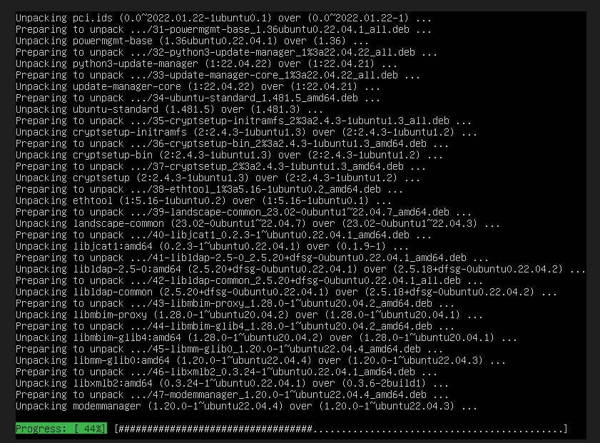

*Updating Ubuntu Server packages before Wazuh installation*

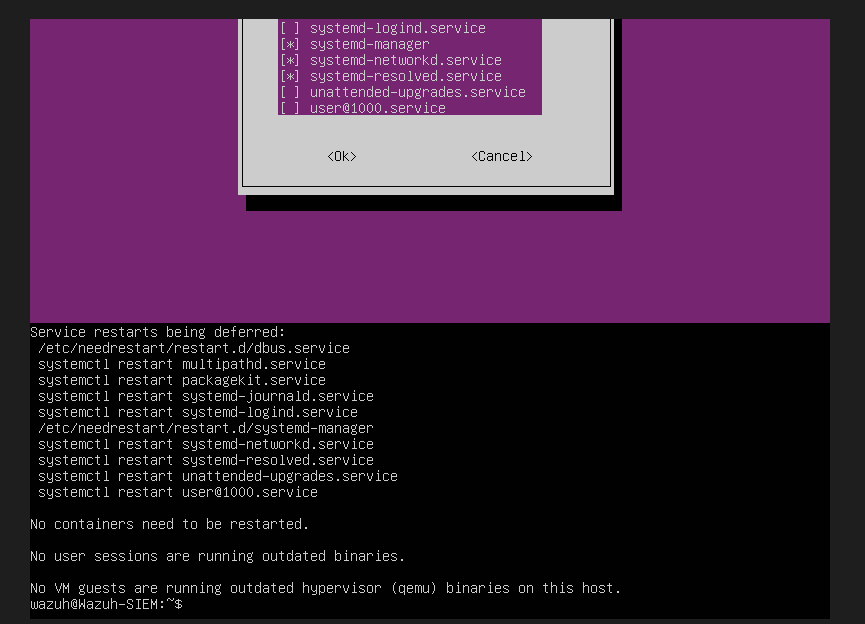

*System update completed successfully*

### Step 2: Download and Run Wazuh Installer

Run the following command to download and install Wazuh:

```bash
curl -sO https://packages.wazuh.com/4.7/wazuh-install.sh && sudo bash wazuh-install.sh -a
```

This command:
- Downloads the official Wazuh installation script
- Runs it with the `-a` flag which installs all 
  components automatically including:
  - Wazuh Server
  - Wazuh Dashboard
  - Wazuh Indexer

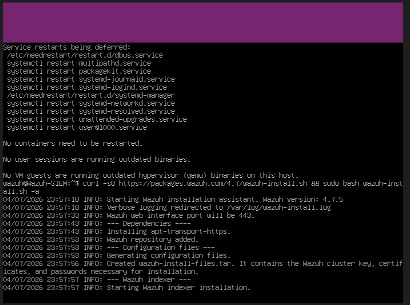

*Wazuh installation in progress*

### Step 3: Installation Complete

Once installation is complete the terminal will 
display your Wazuh dashboard credentials. 

> **Important:** Write down or screenshot your 
> admin username and password immediately as 
> you will need them to access the dashboard.

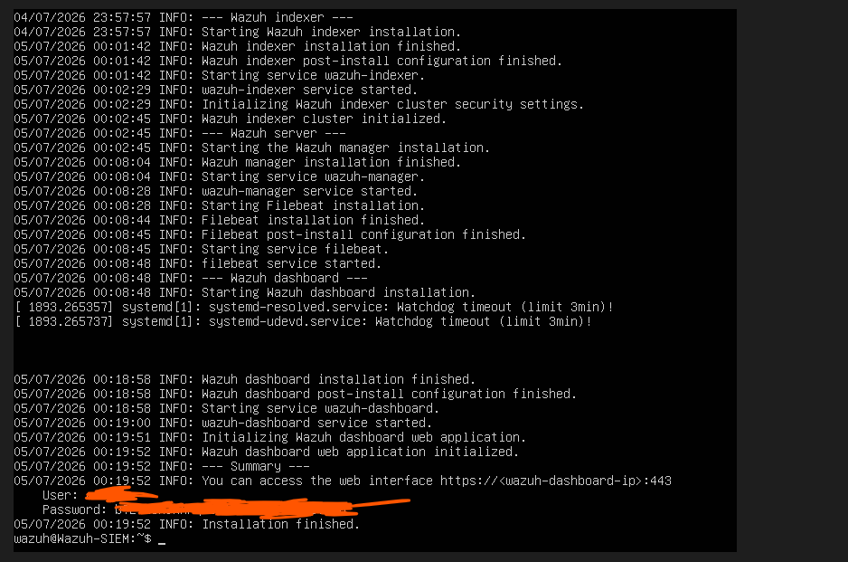

*Wazuh installation complete showing admin credentials*

## Part 3: Accessing the Wazuh Dashboard

### Step 1: Configure Network Adapter

Before accessing the dashboard you need to change 
the VM network adapter to Bridged mode so your 
laptop can communicate with the Wazuh VM.

1. Power off the Wazuh VM
2. In VirtualBox Manager click **Wazuh-SIEM**
3. Click **Settings**
4. Click **Network**
5. Change **Attached to: NAT** to **Attached to: Bridged Adapter**
6. Click **OK**
7. Start the VM again and log in

> Note: Bridged Adapter gives the VM its own IP 
> address on your home network so your laptop 
> browser can access the Wazuh dashboard directly.

### Step 2: Find the Wazuh VM IP Address

In the Wazuh VM terminal run:

```bash
ip a
```

Look for the inet address under enp0s3.

> Note: Your IP address will be different from 
> this guide. Use whatever address appears on 
> your screen.

### Step 3: Access the Dashboard

Open your browser on your laptop and type the 
following in the address bar:

`https://YOUR-WAZUH-IP`

Replace `YOUR-WAZUH-IP` with the IP address 
from the previous step. For example:

`https://192.168.1.197`

> Note: You will see a security certificate warning 
> — this is normal for a self signed certificate. 
> Click **Advanced** then **Proceed** to continue.

### Step 4: Login

Enter your admin credentials that were displayed 
at the end of the installation to access the 
Wazuh dashboard.

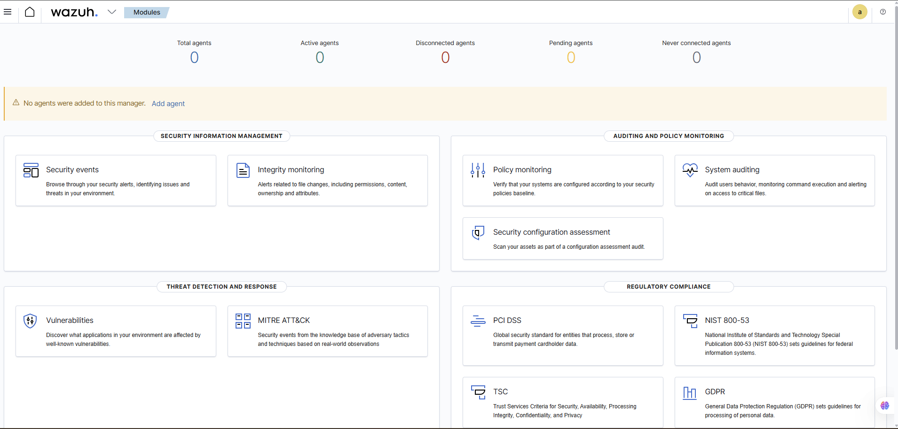

*Wazuh dashboard showing security overview*

## Part 4: Connecting Agents

Wazuh agents are installed on devices you want 
to monitor. They collect security logs and send 
them to the Wazuh server for analysis.

### Agent 1: Raspberry Pi (Pi-hole)

#### Step 1: Generate Installation Command

In the Wazuh dashboard:
1. Click **Agents** in the left sidebar
2. Click **Deploy new agent**
3. Select **Linux** as the operating system
4. Select **aarch64** as the architecture
5. Enter your Wazuh server IP as the server address
6. Enter **raspberry-pi** as the agent name
7. Copy the generated installation command

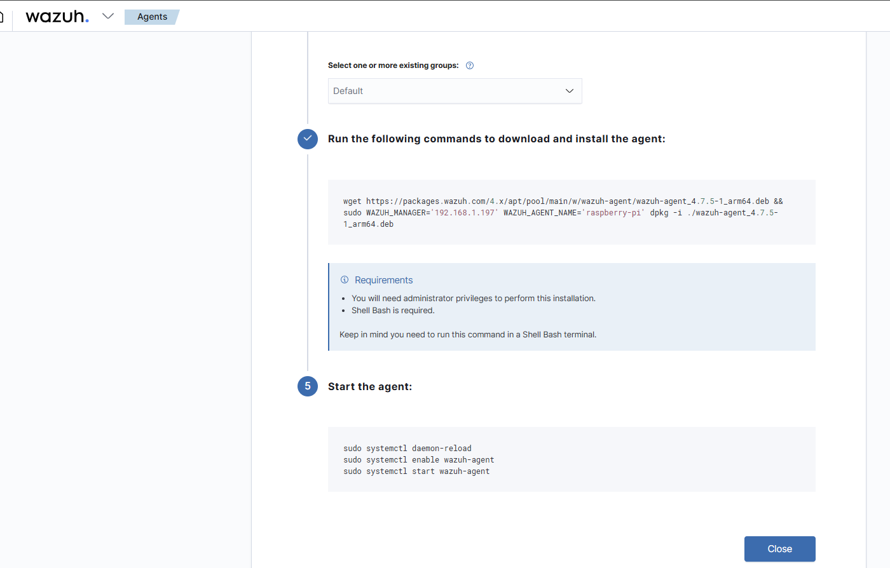

*Wazuh dashboard showing deploy new agent screen*

#### Step 2: Install Agent on Raspberry Pi

SSH into your Raspberry Pi from your laptop:

```bash
ssh homelab@192.168.1.193
```

Run the generated installation command on the Pi:

```bash
wget https://packages.wazuh.com/4.x/apt/pool/main/w/wazuh-agent/wazuh-agent_4.7.5-1_arm64.deb && sudo WAZUH_MANAGER='192.168.1.197' WAZUH_AGENT_NAME='raspberry-pi' dpkg -i ./wazuh-agent_4.7.5-1_arm64.deb
```

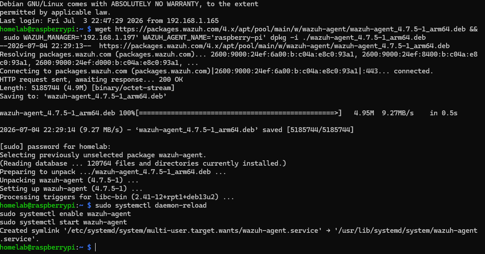

*Wazuh agent installation running on Raspberry Pi terminal*

#### Step 3: Start the Agent

```bash
sudo systemctl daemon-reload
sudo systemctl enable wazuh-agent
sudo systemctl start wazuh-agent
```

#### Step 4: Verify Agent is Running

```bash
sudo systemctl status wazuh-agent
```

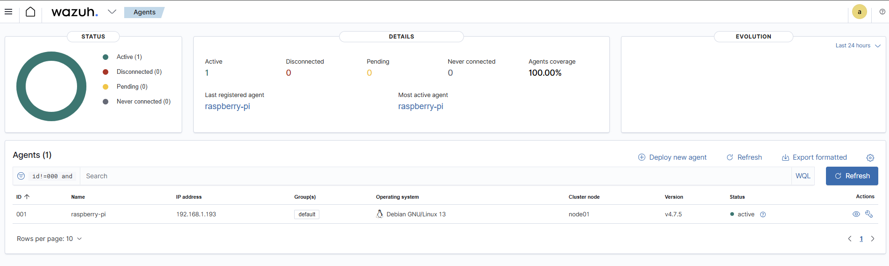

*Wazuh agent showing active running status on Raspberry Pi*

---

### Agent 2: Windows Laptop

#### Step 1: Generate Installation Command

In the Wazuh dashboard:
1. Click **Agents**
2. Click **Deploy new agent**
3. Select **Windows** as the operating system
4. Enter your Wazuh server IP as the server address
5. Enter **windows-laptop** as the agent name
6. Copy the generated PowerShell command

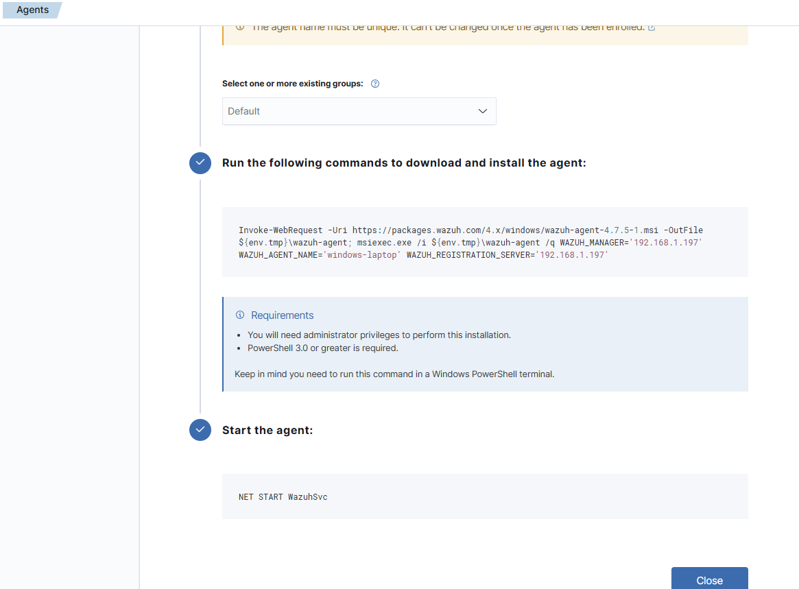

*Wazuh dashboard showing Windows agent installation command*

#### Step 2: Install Agent on Laptop

Open **PowerShell as Administrator** on your laptop and run:

```powershell
Invoke-WebRequest -Uri https://packages.wazuh.com/4.x/windows/wazuh-agent-4.7.5-1.msi -OutFile ${env:tmp}\wazuh-agent.msi; msiexec.exe /i ${env:tmp}\wazuh-agent.msi /q WAZUH_MANAGER='192.168.1.197' WAZUH_AGENT_NAME='windows-laptop' WAZUH_REGISTRATION_SERVER='192.168.1.197'
```

#### Step 3: Fix Server Address

If the agent does not connect check the configuration 
file and ensure the server address is correct:

```powershell
type "C:\Program Files (x86)\ossec-agent\ossec.conf" | Select-String "address"
```

If it shows `0.0.0.0` open the config file and fix it:

```powershell
notepad "C:\Program Files (x86)\ossec-agent\ossec.conf"
```

Find the address line and change it to:

```xml
192.168.1.197
```

Save the file and restart the service:

```powershell
NET STOP WazuhSvc
NET START WazuhSvc
```

#### Step 4: Start the Agent

```powershell
NET START WazuhSvc
```

---

### Verify Both Agents in Dashboard

Go to your Wazuh dashboard and click **Agents**. 
You should see both agents listed as active:

- **raspberry-pi** — Active ✅
- **windows-laptop** — Active ✅

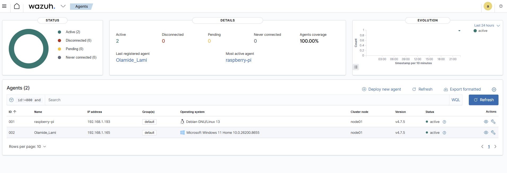

*Wazuh dashboard showing both Raspberry Pi and Windows laptop as active agents*

## Part 5: Configuring Email Alerts

Email alerts allow Wazuh to notify you automatically 
when suspicious activity is detected on your network.
This is a core SOC analyst skill — being notified 
of threats in real time.

### Step 1: Install Postfix Mail Server

SSH into your Wazuh VM and install Postfix:

```bash
sudo apt install postfix libsasl2-modules -y
```

When prompted select **Internet Site** and press Enter.

When asked for the system mail name leave the 
default value and press Enter.

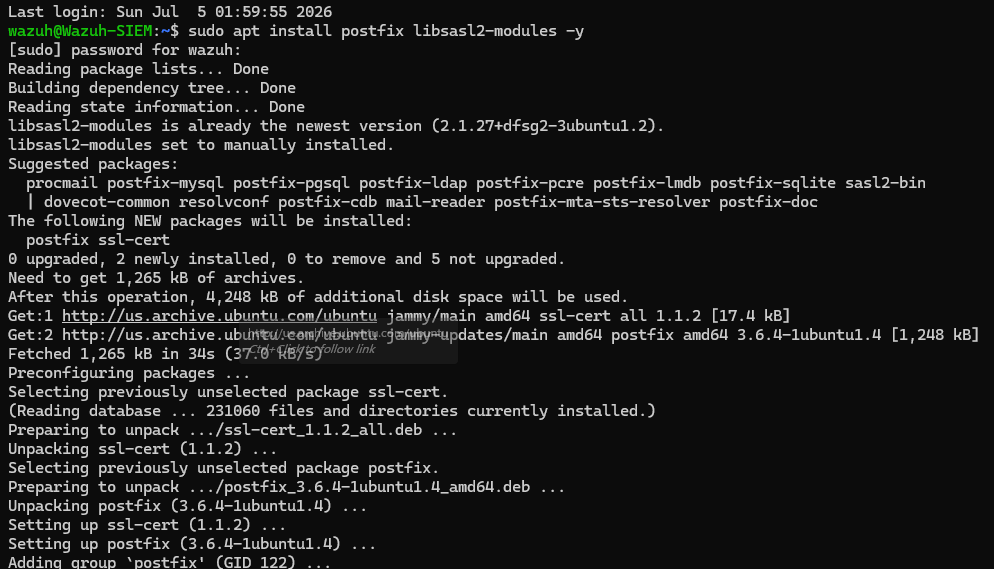

*Installing Postfix mail server on Wazuh VM*

### Step 2: Configure Postfix for Gmail

Edit the Postfix configuration file:

```bash
sudo nano /etc/postfix/main.cf
```

Scroll to the bottom of the file and add the 
following lines:
```
relayhost = [smtp.gmail.com]:587
smtp_sasl_auth_enable = yes
smtp_sasl_password_maps = hash:/etc/postfix/sasl_passwd
smtp_sasl_security_options = noanonymous
smtp_tls_CAfile = /etc/ssl/certs/ca-certificates.crt
smtp_use_tls = yes
```
Press **Ctrl + X** then **Y** then **Enter** to save.

> Note: Check if there is an existing `relayhost=` 
> line at the top of the file. If there is delete 
> it to avoid conflicts — keep only the one you 
> added at the bottom.

### Step 3: Create Gmail App Password

Gmail does not allow direct password authentication 
so you need to create an App Password.

1. Go to [myaccount.google.com](https://myaccount.google.com)
2. In the search bar type **App Passwords**
3. Click **App Passwords** from the results
4. Sign in again if prompted
5. Type **Wazuh** in the text box
6. Click **Create**
7. Copy the generated 16 character password

> **Important:** Store this App Password securely 
> in your password manager. You will need it in 
> the next step.

> Note: The App Password has no spaces — if Google 
> displays it with spaces remove them before using it.

### Step 4: Configure Gmail Credentials

Install mailutils:

```bash
sudo apt install mailutils -y
```

Create the Gmail credentials file:

```bash
sudo nano /etc/postfix/sasl_passwd
```

Add this line replacing with your actual details:
```
[smtp.gmail.com]:587 your-gmail@gmail.com:your-app-password
```
Save and secure the file:

```bash
sudo postmap /etc/postfix/sasl_passwd
sudo chmod 600 /etc/postfix/sasl_passwd
sudo chmod 600 /etc/postfix/sasl_passwd.db
```

### Step 5: Restart Postfix

```bash
sudo systemctl restart postfix
```

### Step 6: Configure Wazuh Email Alerts

Edit the Wazuh configuration file:

```bash
sudo nano /var/ossec/etc/ossec.conf
```

Find the `<global>` section and update the 
following lines:

```xml
<email_notification>yes</email_notification>
<smtp_server>localhost</smtp_server>
<email_from>your-gmail@gmail.com</email_from>
<email_to>your-gmail@gmail.com</email_to>
<email_maxperhour>12</email_maxperhour>
```

Press **Ctrl + X** then **Y** then **Enter** to save.

### Step 7: Restart Wazuh Manager

```bash
sudo systemctl restart wazuh-manager
```

### Step 8: Test Email Alert

Send a test email to verify everything is working:

```bash
echo "Test email from Wazuh" | mail -s "Wazuh Test" your-gmail@gmail.com
```

Replace `your-gmail@gmail.com` with your actual 
Gmail address.

Check your Gmail inbox — you should receive the 
test email within a few minutes.


<p><em>Wazuh test email received in Gmail confirming alerts are working</em></p>


> Note: If you do not receive the email check 
> your **Spam folder** first. Also verify your 
> App Password has no spaces and is entered correctly 
> in the sasl_passwd file.

> Note: You may also receive a **Mail Delivery 
> Subsystem** notification — this is normal when 
> using the same email address for both sender 
> and receiver and can be safely ignored.


## Part 6: Investigating Security Alerts

As a SOC analyst investigating alerts is a core 
responsibility. Not every alert is a real threat 
— determining whether an alert is a true positive 
or false positive is called **alert triage**.

---

### Alert 1: Listened Port Status Changed

**Alert Details:**

| Field | Value |
|---|---|
| Rule ID | 533 |
| Severity | Level 7 (Medium) |
| Device | Raspberry Pi (192.168.1.193) |
| Time | 2026-07-06 04:08:39 |
| Description | Listened ports status changed |

**Investigation:**

Wazuh detected a new port opening on the 
Raspberry Pi. Comparing the before and after 
port lists revealed that UDP port 46501 was 
opened by the pihole-FTL process.

**Open ports on Raspberry Pi:**

| Port | Protocol | Service |
|------|----------|---------|
| 22 | TCP | SSH |
| 53 | TCP/UDP | Pi-hole DNS |
| 80 | TCP | Pi-hole Web Interface |
| 111 | TCP/UDP | RPC |
| 123 | UDP | NTP Time Sync |
| 443 | TCP | Pi-hole HTTPS |
| 5353 | UDP | mDNS |
| 46501 | UDP | Pi-hole FTL (dynamic) |

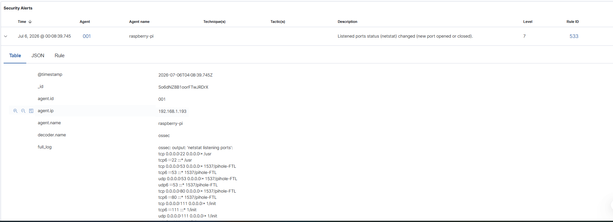
<p><em>Wazuh alert showing listened port status changed on Raspberry Pi</em></p>

**Verdict: False Positive**

The new port was opened by pihole-FTL which 
is the Pi-hole process. This is expected 
behavior as Pi-hole uses dynamic high ports 
for DNS query resolution. No action required.

**Compliance Frameworks Triggered:**
- PCI DSS 10.2.7, 10.6.1
- HIPAA 164.312.b
- NIST 800-53

---

### Alert 2: Failed Authentication Attempts

**Alert Details:**

| Field | Value |
|---|---|
| Rule ID | 2502 |
| Severity | Level 10 (High) |
| Device | Wazuh-SIEM Server |
| Source IP | 192.168.1.165 (Windows Laptop) |
| Time | 2026-07-06 04:07:59 |
| Description | User missed password more than once |
| Fired Times | 2 |

**Investigation:**

Multiple failed SSH authentication attempts were 
detected on the Wazuh-SIEM server originating 
from IP 192.168.1.165 which is the Windows laptop.

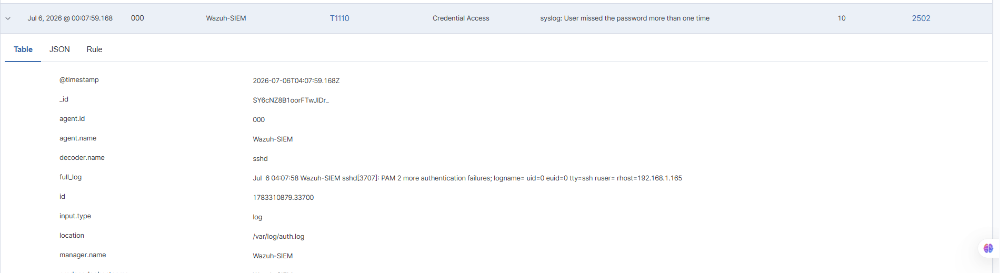
<p><em>Wazuh Level 10 alert showing failed SSH authentication attempts</em></p>

**MITRE ATT&CK Mapping:**

| Field | Value |
|---|---|
| Technique | Brute Force |
| ID | T1110 |
| Tactic | Credential Access |

**Compliance Frameworks Triggered:**
- PCI DSS 10.2.4, 10.2.5
- HIPAA 164.312.b
- NIST 800-53
- GDPR

**Verdict: False Positive**

This was a controlled test performed to verify 
Wazuh alert detection capabilities. The failed 
login attempts were intentionally triggered from 
the Windows laptop to confirm Wazuh was correctly 
detecting and alerting on authentication failures.

**Key Learning:**

In a real environment a Level 10 alert would 
require immediate investigation:

1. Check if the source IP is a known asset
2. Check if the username exists on the system
3. Check if any login was successful
4. If unknown IP — block it immediately
5. If successful login after failures — 
   account may be compromised

**MITRE ATT&CK T1110 - Brute Force:**

Attackers use brute force techniques to gain 
access by systematically trying passwords. 
This is one of the most common attack techniques 
against SSH servers and is directly relevant 
to banking cybersecurity where protecting 
administrative access is critical.